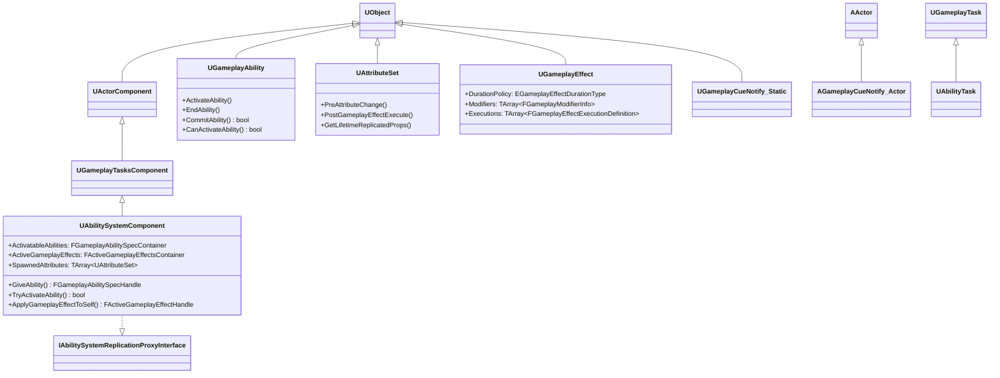
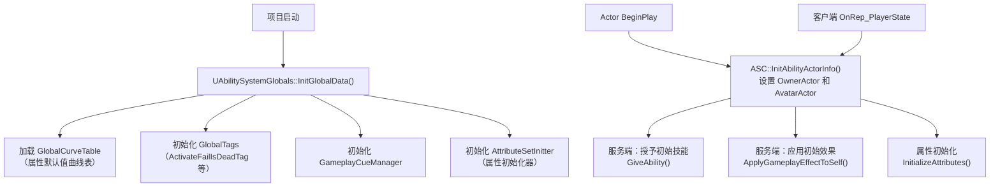
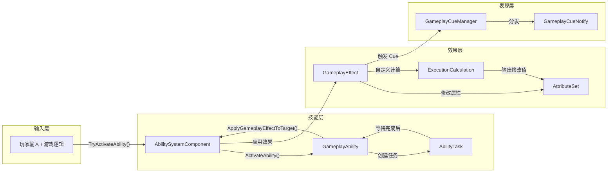
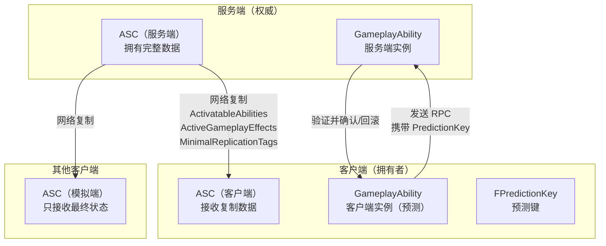

# GAS 整体架构概述

> **源码依据**：综合分析 `AbilitySystemComponent.h`、`GameplayAbility.h`、`AttributeSet.h`、`GameplayEffect.h`、`AbilitySystemInterface.h`、`AbilitySystemGlobals.h`

---

## 1. GAS 是什么

GAS（Gameplay Ability System）是 Epic Games 为 UE4 提供的一套完整的**技能与效果框架**，最初为《堡垒之夜》开发，后作为引擎插件开放。它解决了以下核心问题：

- **技能系统**：定义、授予、激活、取消技能
- **属性系统**：管理角色数值（生命值、攻击力等），支持网络同步
- **效果系统**：定义对属性的修改规则（伤害、治疗、Buff/Debuff）
- **标签系统**：通过层级标签控制技能激活条件、状态管理
- **表现层**：通过 GameplayCue 将逻辑与视觉/音效解耦
- **网络预测**：内置客户端预测机制，减少网络延迟感

---

## 2. 核心组件总览

GAS 由以下七大核心组件构成：

| 组件 | 类型 | 职责 |
|------|------|------|
| `UAbilitySystemComponent` | UActorComponent 子类 | **核心枢纽**，管理所有 GAS 功能 |
| `UGameplayAbility` | UObject 子类 | 定义单个技能的完整行为逻辑 |
| `UAttributeSet` | UObject 子类 | 定义并持有角色属性数值 |
| `UGameplayEffect` | UObject 子类（数据资产） | 定义对属性的修改规则 |
| `FGameplayTag` | 结构体 | 层级化标签，用于条件判断和通信 |
| `UGameplayCueNotify_*` | UObject/AActor 子类 | 技能表现层（特效、音效等） |
| `UAbilityTask` | UGameplayTask 子类 | 技能内的异步操作 |

---

## 3. 类继承关系



---

## 4. Actor 接入 GAS 的方式

### 4.1 IAbilitySystemInterface 接口

来源：`Public/AbilitySystemInterface.h`

```cpp
// Actor 需要实现此接口，才能被 GAS 系统识别
class GAMEPLAYABILITIES_API IAbilitySystemInterface
{
    GENERATED_IINTERFACE_BODY()

    // 返回该 Actor 使用的 AbilitySystemComponent
    // 注意：ASC 可以不在 Actor 自身上，例如 Pawn 可以使用 PlayerState 上的 ASC
    virtual UAbilitySystemComponent* GetAbilitySystemComponent() const = 0;
};
```

### 4.2 两种常见的 ASC 归属方式

**方式一：ASC 在 Pawn 自身上**
```
APawn
  └── UAbilitySystemComponent  ← ASC 直接挂在 Pawn 上
  └── UMyAttributeSet          ← AttributeSet 也在 Pawn 上
```

**方式二：ASC 在 PlayerState 上（推荐用于玩家角色）**
```
APlayerState
  └── UAbilitySystemComponent  ← ASC 在 PlayerState 上（跨 Pawn 持久化）
  └── UMyAttributeSet

APawn
  └── 实现 IAbilitySystemInterface，返回 PlayerState 上的 ASC
```

> **为什么推荐方式二？** 当玩家死亡重生时，Pawn 会被销毁重建，但 PlayerState 持续存在，ASC 上的技能、属性、效果不会丢失。

---

## 5. GAS 初始化流程



### 5.1 InitAbilityActorInfo 的重要性

来源：`AbilitySystemComponent.h`

```cpp
// 必须在 BeginPlay 或 Possess 时调用，设置 Owner 和 Avatar
// OwnerActor: 拥有 ASC 的 Actor（通常是 PlayerState 或 Pawn）
// AvatarActor: 实际在世界中的 Actor（通常是 Pawn）
virtual void InitAbilityActorInfo(AActor* InOwnerActor, AActor* InAvatarActor);
```

---

## 6. 数据流向



---

## 7. 网络架构

GAS 是为多人游戏设计的，其网络架构如下：



### 7.1 三种网络角色

| 角色 | 说明 | 能做什么 |
|------|------|----------|
| **Authority（服务端）** | 拥有完整权威数据 | 可以做任何操作 |
| **AutonomousProxy（本地玩家）** | 本地控制的 Pawn | 可以发起预测，等待服务端确认 |
| **SimulatedProxy（其他玩家）** | 远端玩家在本地的模拟 | 只接收复制数据，不能主动操作 |

---

## 8. 关键枚举速查

### 8.1 技能实例化策略（来源：`GameplayAbility.h`）

```cpp
UENUM(BlueprintType)
namespace EGameplayAbilityInstancingPolicy
{
    enum Type
    {
        // 不实例化，使用 CDO 直接执行（最轻量，不能有状态）
        NonInstanced,
        // 每个 Actor 一个实例（最常用）
        InstancedPerActor,
        // 每次执行一个实例（支持并发执行同一技能）
        InstancedPerExecution,
    };
}
```

### 8.2 技能网络执行策略（来源：`GameplayAbility.h`）

```cpp
UENUM(BlueprintType)
namespace EGameplayAbilityNetExecutionPolicy
{
    enum Type
    {
        LocalPredicted,   // 本地预测执行（最常用）
        LocalOnly,        // 仅本地执行（单机或纯客户端逻辑）
        ServerInitiated,  // 服务端发起
        ServerOnly,       // 仅服务端执行
    };
}
```

### 8.3 GameplayEffect 持续类型（来源：`GameplayEffect.h`）

```cpp
UENUM(BlueprintType)
namespace EGameplayEffectDurationType
{
    enum Type
    {
        Instant,   // 瞬时效果（立即修改 BaseValue）
        Infinite,  // 无限持续（持续修改 CurrentValue）
        HasDuration, // 有限持续时间
    };
}
```

---

## 9. 文档导航

- 下一篇：[02 - AbilitySystemComponent 核心组件](./02_AbilitySystemComponent.md)
- 返回：[总目录](./00_GAS学习文档总目录.md)
