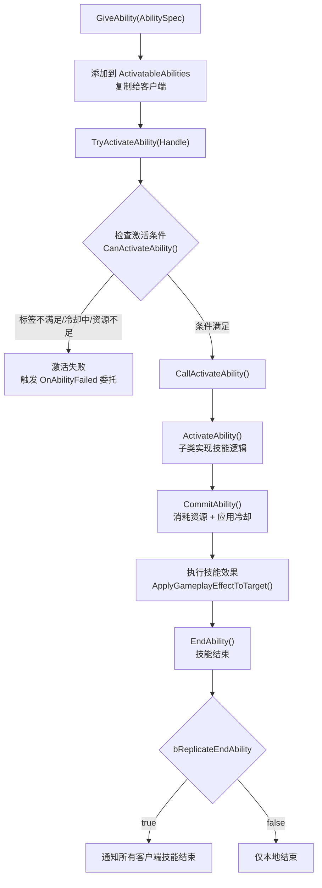

# AbilitySystemComponent（ASC）核心组件详解

> **源码文件**：`Public/AbilitySystemComponent.h`（87.18 KB，1632行）
> **继承链**：`UObject → UActorComponent → UGameplayTasksComponent → UAbilitySystemComponent`

---

## 1. 概述

`UAbilitySystemComponent`（简称 ASC）是 GAS 框架的**核心枢纽**。它是一个 `UActorComponent`，挂载在 Actor 上，负责：

- **技能管理**：授予、移除、激活、取消技能
- **效果管理**：应用、移除 GameplayEffect，维护激活效果列表
- **属性管理**：持有 AttributeSet，提供属性查询接口
- **标签管理**：维护当前 Actor 的 GameplayTag 计数
- **网络同步**：复制技能列表、激活效果、标签状态
- **预测支持**：管理预测键，支持客户端预测

---

## 2. 核心数据成员

来源：`Public/AbilitySystemComponent.h`

### 2.1 技能相关

```cpp
// 所有已授予的技能规格列表（通过 GiveAbility 添加）
// ReplicatedUsing=OnRep_ActivatableAbilities 表示复制时触发回调
UPROPERTY(ReplicatedUsing=OnRep_ActivatableAbilities, BlueprintReadOnly, Category = "Abilities")
FGameplayAbilitySpecContainer ActivatableAbilities;
```

### 2.2 效果相关

```cpp
// 当前所有激活中的 GameplayEffect 容器
// 这是一个 FFastArraySerializer，支持高效网络复制
FActiveGameplayEffectsContainer ActiveGameplayEffects;
```

### 2.3 属性相关

```cpp
// 所有已注册的 AttributeSet 列表
// 通过 AddAttributeSetSubobject() 或在构造函数中 CreateDefaultSubobject 添加
UPROPERTY(Replicated)
TArray<UAttributeSet*> SpawnedAttributes;
```

### 2.4 标签相关

```cpp
// 当前 Actor 拥有的 GameplayTag 计数容器（本地，不复制）
FGameplayTagCountContainer GameplayTagCountContainer;

// 用于最小化复制的标签计数 Map（复制给所有客户端）
UPROPERTY(Replicated)
FMinimalReplicationTagCountMap MinimalReplicationTags;

// 用于仅复制给拥有者的标签计数 Map
UPROPERTY(Replicated)
FMinimalReplicationTagCountMap ReplicatedTagCountMap;
```

### 2.5 网络相关

```cpp
// 当前预测键（客户端预测使用）
FPredictionKey ScopedPredictionKey;

// 服务端确认的预测键（用于验证客户端预测）
UPROPERTY(ReplicatedUsing=OnRep_ServerCurrentActivationInfo)
FGameplayAbilityActivationInfo ServerCurrentActivationInfo;
```

---

## 3. 技能管理 API

### 3.1 授予技能

```cpp
// 授予一个技能，返回技能句柄（用于后续引用该技能）
// 只能在服务端调用
FGameplayAbilitySpecHandle GiveAbility(const FGameplayAbilitySpec& AbilitySpec);

// 授予技能并立即激活（激活后自动移除）
FGameplayAbilitySpecHandle GiveAbilityAndActivateOnce(
    FGameplayAbilitySpec& AbilitySpec,
    const FGameplayEventData* GameplayEventData = nullptr
);
```

**使用示例**：
```cpp
// 构造技能规格并授予
FGameplayAbilitySpec AbilitySpec(
    AbilityClass,       // 技能类
    AbilityLevel,       // 技能等级
    InputID,            // 输入绑定 ID（可选）
    SourceObject        // 来源对象（可选）
);
FGameplayAbilitySpecHandle Handle = AbilitySystemComponent->GiveAbility(AbilitySpec);
```

### 3.2 移除技能

```cpp
// 通过句柄移除技能
void ClearAbility(const FGameplayAbilitySpecHandle& Handle);

// 移除所有技能
void ClearAllAbilities();

// 移除所有技能并取消激活中的技能
void ClearAllAbilitiesWithInputID(int32 InputID);
```

### 3.3 激活技能

```cpp
// 尝试通过句柄激活技能（最常用）
// 返回 true 表示激活成功
bool TryActivateAbility(
    FGameplayAbilitySpecHandle AbilityToActivate,
    bool bAllowRemoteActivation = true
);

// 尝试通过类激活技能
bool TryActivateAbilityByClass(
    TSubclassOf<UGameplayAbility> InAbilityToActivate,
    bool bAllowRemoteActivation = true
);

// 通过 GameplayTag 激活技能（激活所有匹配标签的技能）
bool TryActivateAbilitiesByTag(
    const FGameplayTagContainer& GameplayTagContainer,
    bool bAllowRemoteActivation = true
);
```

### 3.4 取消技能

```cpp
// 取消所有匹配标签的技能
void CancelAbilities(
    const FGameplayTagContainer* WithTags = nullptr,
    const FGameplayTagContainer* WithoutTags = nullptr,
    UGameplayAbility* Ignore = nullptr
);

// 取消所有技能
void CancelAllAbilities(UGameplayAbility* Ignore = nullptr);

// 取消指定句柄的技能
void CancelAbilityHandle(const FGameplayAbilitySpecHandle& AbilityHandle);
```

### 3.5 查询技能

```cpp
// 通过句柄查找技能规格（返回指针，可能为 null）
FGameplayAbilitySpec* FindAbilitySpecFromHandle(FGameplayAbilitySpecHandle Handle);

// 通过类查找技能规格
FGameplayAbilitySpec* FindAbilitySpecFromClass(TSubclassOf<UGameplayAbility> InAbilityClass);

// 通过输入 ID 查找技能规格
FGameplayAbilitySpec* FindAbilitySpecFromInputID(int32 InputID);

// 获取所有激活中的技能
void GetActivatableGameplayAbilitySpecsByAllMatchingTags(
    const FGameplayTagContainer& GameplayTagContainer,
    TArray<FGameplayAbilitySpec*>& MatchingGameplayAbilities,
    bool bOnlyAbilitiesThatSatisfyTagRequirements = true
) const;
```

---

## 4. GameplayEffect 管理 API

### 4.1 应用效果

```cpp
// 应用效果到自身（最常用）
FActiveGameplayEffectHandle ApplyGameplayEffectToSelf(
    const UGameplayEffect* GameplayEffect,
    float Level,
    FGameplayEffectContextHandle EffectContext,
    FPredictionKey PredictionKey = FPredictionKey()
);

// 应用效果到目标
FActiveGameplayEffectHandle ApplyGameplayEffectToTarget(
    UGameplayEffect* GameplayEffect,
    UAbilitySystemComponent* Target,
    float Level = UGameplayEffect::INVALID_LEVEL,
    FGameplayEffectContextHandle Context = FGameplayEffectContextHandle(),
    FPredictionKey PredictionKey = FPredictionKey()
);

// 通过已构建的 Spec 应用效果（更灵活）
FActiveGameplayEffectHandle ApplyGameplayEffectSpecToSelf(
    const FGameplayEffectSpec& GameplayEffect,
    FPredictionKey PredictionKey = FPredictionKey()
);

FActiveGameplayEffectHandle ApplyGameplayEffectSpecToTarget(
    const FGameplayEffectSpec& GameplayEffect,
    UAbilitySystemComponent* Target,
    FPredictionKey PredictionKey = FPredictionKey()
);
```

### 4.2 移除效果

```cpp
// 通过句柄移除效果
bool RemoveActiveGameplayEffect(
    FActiveGameplayEffectHandle Handle,
    int32 StacksToRemove = -1  // -1 表示移除所有层
);

// 通过资产标签移除效果
int32 RemoveActiveGameplayEffectBySourceEffect(
    TSubclassOf<UGameplayEffect> GameplayEffect,
    UAbilitySystemComponent* InstigatorAbilitySystemComponent,
    int32 StacksToRemove = -1
);

// 通过 GameplayTag 移除效果
int32 RemoveActiveEffectsWithTags(const FGameplayTagContainer& Tags);

// 通过来源对象移除效果
int32 RemoveActiveEffectsWithSourceTags(const FGameplayTagContainer& Tags);
```

### 4.3 构建 EffectSpec

```cpp
// 构建效果规格（用于后续应用）
FGameplayEffectSpecHandle MakeOutgoingSpec(
    TSubclassOf<UGameplayEffect> GameplayEffectClass,
    float Level,
    FGameplayEffectContextHandle Context
) const;

// 构建效果上下文
FGameplayEffectContextHandle MakeEffectContext();
```

### 4.4 查询效果

```cpp
// 检查是否有匹配标签的激活效果
bool HasMatchingGameplayTag(FGameplayTag TagToCheck) const;

// 获取效果的剩余时间
float GetGameplayEffectDuration(FActiveGameplayEffectHandle Handle) const;

// 获取效果的堆叠数
int32 GetCurrentStackCount(FActiveGameplayEffectHandle Handle) const;
```

---

## 5. 属性管理 API

```cpp
// 获取属性当前值（CurrentValue，受 Modifier 影响）
float GetNumericAttribute(const FGameplayAttribute& Attribute) const;

// 获取属性基础值（BaseValue，不受 Modifier 影响）
float GetNumericAttributeBase(const FGameplayAttribute& Attribute) const;

// 设置属性基础值（直接修改，不通过 GE）
void SetNumericAttributeBase(const FGameplayAttribute& Attribute, float NewBaseValue);

// 注册属性变化回调
FOnGameplayAttributeValueChange& GetGameplayAttributeValueChangeDelegate(
    FGameplayAttribute Attribute
);
```

**使用示例**：
```cpp
// 监听生命值变化
AbilitySystemComponent->GetGameplayAttributeValueChangeDelegate(
    UMyAttributeSet::GetHealthAttribute()
).AddUObject(this, &AMyCharacter::OnHealthChanged);
```

---

## 6. 标签管理 API

```cpp
// 检查是否拥有某个标签
bool HasMatchingGameplayTag(FGameplayTag TagToCheck) const;

// 检查是否拥有所有标签
bool HasAllMatchingGameplayTags(const FGameplayTagContainer& TagContainer) const;

// 检查是否拥有任意标签
bool HasAnyMatchingGameplayTags(const FGameplayTagContainer& TagContainer) const;

// 手动添加标签（不通过 GE）
void AddLooseGameplayTag(const FGameplayTag& GameplayTag, int32 Count = 1);
void AddLooseGameplayTags(const FGameplayTagContainer& GameplayTags, int32 Count = 1);

// 手动移除标签
void RemoveLooseGameplayTag(const FGameplayTag& GameplayTag, int32 Count = 1);
void RemoveLooseGameplayTags(const FGameplayTagContainer& GameplayTags, int32 Count = 1);

// 注册标签变化回调
FOnGameplayEffectTagCountChanged& RegisterGameplayTagEvent(
    FGameplayTag Tag,
    EGameplayTagEventType::Type EventType = EGameplayTagEventType::NewOrRemoved
);
```

---

## 7. GameplayCue 触发 API

```cpp
// 执行一次性 Cue（对应 Executed 事件）
void ExecuteGameplayCue(
    const FGameplayTag GameplayCueTag,
    FGameplayEffectContextHandle EffectContext = FGameplayEffectContextHandle()
);

// 添加持续 Cue（对应 OnActive + WhileActive 事件）
void AddGameplayCue(
    const FGameplayTag GameplayCueTag,
    FGameplayEffectContextHandle EffectContext = FGameplayEffectContextHandle()
);

// 移除持续 Cue（对应 OnRemove 事件）
void RemoveGameplayCue(const FGameplayTag GameplayCueTag);
```

---

## 8. 游戏事件 API

```cpp
// 发送游戏事件（可被 AbilityTask_WaitGameplayEvent 监听）
void HandleGameplayEvent(
    FGameplayTag EventTag,
    const FGameplayEventData* Payload
);

// 注册游戏事件监听
FDelegateHandle RegisterGameplayEventCallback(
    FGameplayTag Tag,
    TFunction<void(const FGameplayEventData*)> Func
);
```

---

## 9. 网络复制机制

### 9.1 复制的数据

| 数据 | 复制方式 | 说明 |
|------|----------|------|
| `ActivatableAbilities` | `ReplicatedUsing=OnRep_ActivatableAbilities` | 技能列表，使用 FFastArraySerializer |
| `ActiveGameplayEffects` | FFastArraySerializer | 激活效果列表，高效增量复制 |
| `SpawnedAttributes` | `Replicated` | 属性集列表 |
| `MinimalReplicationTags` | `Replicated` | 最小化标签复制（给所有客户端） |
| `ReplicatedTagCountMap` | `Replicated` | 标签复制（仅给拥有者） |

### 9.2 GetLifetimeReplicatedProps

```cpp
// ASC 注册复制属性（来源：AbilitySystemComponent.cpp）
void UAbilitySystemComponent::GetLifetimeReplicatedProps(
    TArray<FLifetimeProperty>& OutLifetimeProps) const
{
    // ActivatableAbilities 复制给所有人
    DOREPLIFETIME(UAbilitySystemComponent, ActivatableAbilities);
    // SpawnedAttributes 复制给所有人
    DOREPLIFETIME(UAbilitySystemComponent, SpawnedAttributes);
    // 最小化标签复制给所有人
    DOREPLIFETIME(UAbilitySystemComponent, MinimalReplicationTags);
    // 拥有者专属标签复制
    DOREPLIFETIME_CONDITION(UAbilitySystemComponent, ReplicatedTagCountMap, COND_OwnerOnly);
}
```

---

## 10. 输入绑定

ASC 支持将技能与输入绑定，通过 InputID 关联：

```cpp
// 当输入按下时调用（激活绑定了该 InputID 的技能）
void AbilityLocalInputPressed(int32 InputID);

// 当输入释放时调用
void AbilityLocalInputReleased(int32 InputID);

// 确认/取消目标选择
void LocalInputConfirm();
void LocalInputCancel();
```

---

## 11. 完整工作流程



---

## 12. 文档导航

- 上一篇：[01 - GAS 整体架构概述](./01_GAS整体架构概述.md)
- 下一篇：[03 - GameplayAbility 技能系统](./03_GameplayAbility.md)
- 返回：[总目录](./00_GAS学习文档总目录.md)
