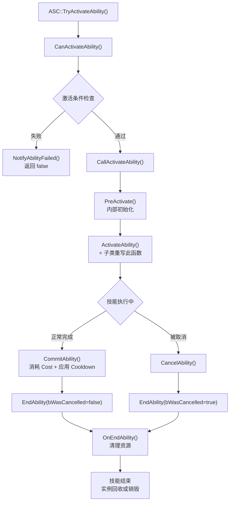
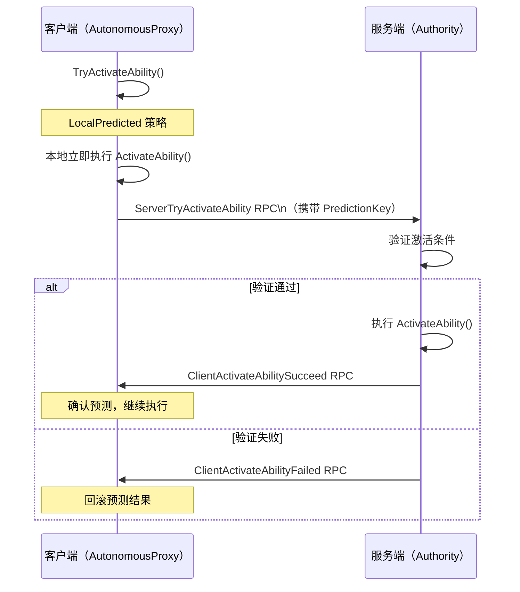

# GameplayAbility 技能系统详解

> **源码文件**：`Public/Abilities/GameplayAbility.h`（47.00 KB，891行）
> **继承链**：`UObject → UGameplayAbility`

---

## 1. 概述

`UGameplayAbility` 是 GAS 中**技能的基类**，定义了一个技能从激活到结束的完整行为。每个具体技能都继承自此类并重写关键虚函数。

核心职责：
- 定义技能的**激活条件**（标签需求、冷却、资源消耗）
- 定义技能的**执行逻辑**（`ActivateAbility` 虚函数）
- 管理技能的**生命周期**（激活 → 执行 → 结束）
- 控制技能的**网络行为**（本地预测、服务端权威）

---

## 2. 三大策略枚举

这三个枚举决定了技能的实例化方式、网络执行方式和复制方式，是理解 GAS 技能系统的关键。

### 2.1 实例化策略（InstancingPolicy）

来源：`Public/Abilities/GameplayAbility.h`

```cpp
UENUM(BlueprintType)
namespace EGameplayAbilityInstancingPolicy
{
    enum Type
    {
        // 不实例化：直接使用 CDO（Class Default Object）执行
        // 优点：零内存开销，最高性能
        // 缺点：不能有任何运行时状态，不能使用 AbilityTask
        NonInstanced,

        // 每个 Actor 一个实例（最常用）
        // 优点：可以有状态，支持 AbilityTask
        // 缺点：同一技能同时只能有一个激活实例
        InstancedPerActor,

        // 每次执行一个新实例
        // 优点：支持同一技能并发执行多次
        // 缺点：内存开销最大
        InstancedPerExecution,
    };
}
```

### 2.2 网络执行策略（NetExecutionPolicy）

```cpp
UENUM(BlueprintType)
namespace EGameplayAbilityNetExecutionPolicy
{
    enum Type
    {
        // 本地预测：客户端立即执行，同时通知服务端
        // 服务端验证后确认或回滚
        // 适用于：大多数玩家主动技能
        LocalPredicted,

        // 仅本地执行：不通知服务端
        // 适用于：纯表现层技能、单机游戏
        LocalOnly,

        // 服务端发起：服务端决定何时激活，通知客户端
        // 适用于：AI 技能、服务端触发的技能
        ServerInitiated,

        // 仅服务端执行：客户端不执行
        // 适用于：纯逻辑技能，无需客户端表现
        ServerOnly,
    };
}
```

### 2.3 复制策略（ReplicationPolicy）

```cpp
UENUM(BlueprintType)
namespace EGameplayAbilityReplicationPolicy
{
    enum Type
    {
        // 不复制技能实例（默认，大多数情况使用）
        ReplicateNo,

        // 复制技能实例到所有客户端
        // 注意：只有 InstancedPerActor 策略才支持复制
        ReplicateYes,
    };
}
```

---

## 3. 技能生命周期



### 3.1 关键生命周期函数

```cpp
// ==================== 激活阶段 ====================

// 检查技能是否可以激活（不消耗资源，只检查条件）
// 子类可重写以添加自定义条件检查
virtual bool CanActivateAbility(
    const FGameplayAbilitySpecHandle Handle,
    const FGameplayAbilityActorInfo* ActorInfo,
    const FGameplayTagContainer* SourceTags = nullptr,
    const FGameplayTagContainer* TargetTags = nullptr,
    OUT FGameplayTagContainer* OptionalRelevantTags = nullptr
) const;

// ⭐ 技能激活入口，子类必须重写此函数实现技能逻辑
// 注意：必须在某个时刻调用 EndAbility()，否则技能永远不会结束
virtual void ActivateAbility(
    const FGameplayAbilitySpecHandle Handle,
    const FGameplayAbilityActorInfo* ActorInfo,
    const FGameplayAbilityActivationInfo ActivationInfo,
    const FGameplayEventData* TriggerEventData
);

// ==================== 提交阶段 ====================

// 提交技能：同时检查并消耗 Cost + 应用 Cooldown
// 通常在 ActivateAbility 开始时调用
// 返回 false 表示无法提交（资源不足或冷却中）
virtual bool CommitAbility(
    const FGameplayAbilitySpecHandle Handle,
    const FGameplayAbilityActorInfo* ActorInfo,
    const FGameplayAbilityActivationInfo ActivationInfo,
    OUT FGameplayTagContainer* OptionalRelevantTags = nullptr
);

// 仅检查 Cost（不消耗）
virtual bool CheckCost(
    const FGameplayAbilitySpecHandle Handle,
    const FGameplayAbilityActorInfo* ActorInfo,
    OUT FGameplayTagContainer* OptionalRelevantTags = nullptr
) const;

// 仅检查 Cooldown（不应用）
virtual bool CheckCooldown(
    const FGameplayAbilitySpecHandle Handle,
    const FGameplayAbilityActorInfo* ActorInfo,
    OUT FGameplayTagContainer* OptionalRelevantTags = nullptr
) const;

// ==================== 结束阶段 ====================

// 结束技能（必须调用，否则技能永远激活）
// bWasCancelled: true 表示被取消，false 表示正常结束
// bReplicateEndAbility: 是否通知其他端技能结束
virtual void EndAbility(
    const FGameplayAbilitySpecHandle Handle,
    const FGameplayAbilityActorInfo* ActorInfo,
    const FGameplayAbilityActivationInfo ActivationInfo,
    bool bReplicateEndAbility,
    bool bWasCancelled
);

// 取消技能（内部调用 EndAbility）
virtual void CancelAbility(
    const FGameplayAbilitySpecHandle Handle,
    const FGameplayAbilityActorInfo* ActorInfo,
    const FGameplayAbilityActivationInfo ActivationInfo,
    bool bReplicateCancelAbility
);
```

---

## 4. 激活条件配置

### 4.1 标签需求（来源：`GameplayAbility.h`）

```cpp
// 技能激活时，Owner Actor 必须拥有这些标签
UPROPERTY(EditDefaultsOnly, Category = Tags, meta=(Categories="AbilityTagCategory"))
FGameplayTagContainer ActivationRequiredTags;

// 技能激活时，Owner Actor 不能拥有这些标签
UPROPERTY(EditDefaultsOnly, Category = Tags, meta=(Categories="AbilityTagCategory"))
FGameplayTagContainer ActivationBlockedTags;

// 技能激活时，Source Actor 必须拥有这些标签
UPROPERTY(EditDefaultsOnly, Category = Tags)
FGameplayTagContainer SourceRequiredTags;

// 技能激活时，Source Actor 不能拥有这些标签
UPROPERTY(EditDefaultsOnly, Category = Tags)
FGameplayTagContainer SourceBlockedTags;

// 技能激活时，Target Actor 必须拥有这些标签
UPROPERTY(EditDefaultsOnly, Category = Tags)
FGameplayTagContainer TargetRequiredTags;

// 技能激活时，Target Actor 不能拥有这些标签
UPROPERTY(EditDefaultsOnly, Category = Tags)
FGameplayTagContainer TargetBlockedTags;
```

### 4.2 技能自身标签

```cpp
// 技能自身的标签（用于被其他系统查询）
UPROPERTY(EditDefaultsOnly, Category = Tags, meta=(Categories="AbilityTagCategory"))
FGameplayTagContainer AbilityTags;

// 技能激活时，会给 Owner 添加这些标签
// 技能结束时，自动移除
UPROPERTY(EditDefaultsOnly, Category = Tags)
FGameplayTagContainer ActivationOwnedTags;

// 技能激活时，会阻止其他拥有这些标签的技能激活
UPROPERTY(EditDefaultsOnly, Category = Tags)
FGameplayTagContainer BlockAbilitiesWithTag;

// 技能激活时，会取消其他拥有这些标签的技能
UPROPERTY(EditDefaultsOnly, Category = Tags)
FGameplayTagContainer CancelAbilitiesWithTag;
```

### 4.3 冷却与消耗

```cpp
// 冷却效果（一个 GameplayEffect，通常是 HasDuration 类型）
UPROPERTY(EditDefaultsOnly, Category = Cooldowns)
TSubclassOf<class UGameplayEffect> CooldownGameplayEffectClass;

// 消耗效果（一个 GameplayEffect，通常是 Instant 类型，减少 Mana/Stamina 等）
UPROPERTY(EditDefaultsOnly, Category = Costs)
TSubclassOf<class UGameplayEffect> CostGameplayEffectClass;
```

---

## 5. 触发器配置

技能可以通过 GameplayTag 事件触发（而不仅仅通过 `TryActivateAbility`）：

```cpp
// 触发器列表：当指定 GameplayTag 事件发生时，自动激活此技能
UPROPERTY(EditDefaultsOnly, Category = Triggers)
TArray<FAbilityTriggerData> AbilityTriggers;
```

`FAbilityTriggerData` 结构：
```cpp
USTRUCT(BlueprintType)
struct FAbilityTriggerData
{
    // 触发此技能的 GameplayTag
    UPROPERTY(EditDefaultsOnly, Category=GameplayAbility)
    FGameplayTag TriggerTag;

    // 触发来源（GameplayEvent 或 OwnedTag）
    UPROPERTY(EditDefaultsOnly, Category=GameplayAbility)
    TEnumAsByte<EGameplayAbilityTriggerSource::Type> TriggerSource;
};
```

---

## 6. ActorInfo：技能的上下文信息

`FGameplayAbilityActorInfo` 包含技能执行时需要的所有 Actor 引用：

```cpp
struct GAMEPLAYABILITIES_API FGameplayAbilityActorInfo
{
    // 拥有 ASC 的 Actor（通常是 PlayerState 或 Pawn）
    TWeakObjectPtr<AActor> OwnerActor;

    // 实际在世界中的 Actor（通常是 Pawn）
    TWeakObjectPtr<AActor> AvatarActor;

    // PlayerController（可能为 null，如 AI）
    TWeakObjectPtr<APlayerController> PlayerController;

    // 角色的 AbilitySystemComponent
    TWeakObjectPtr<UAbilitySystemComponent> AbilitySystemComponent;

    // 角色的 SkeletalMeshComponent（用于播放动画）
    TWeakObjectPtr<USkeletalMeshComponent> SkeletalMeshComponent;

    // 角色的 AnimInstance
    TWeakObjectPtr<UAnimInstance> AnimInstance;

    // 角色的 MovementComponent
    TWeakObjectPtr<UMovementComponent> MovementComponent;

    // 是否是本地控制（AutonomousProxy 或 Authority）
    bool IsLocallyControlled() const;

    // 是否是服务端权威
    bool IsNetAuthority() const;
};
```

---

## 7. 技能中常用的辅助函数

```cpp
// 获取 AvatarActor（世界中的 Actor）
AActor* GetAvatarActorFromActorInfo() const;

// 获取 OwnerActor（拥有 ASC 的 Actor）
AActor* GetOwningActorFromActorInfo() const;

// 获取 AbilitySystemComponent
UAbilitySystemComponent* GetAbilitySystemComponentFromActorInfo() const;

// 获取 SkeletalMeshComponent
USkeletalMeshComponent* GetOwningComponentFromActorInfo() const;

// 获取当前技能等级
int32 GetAbilityLevel() const;

// 获取技能等级对应的 ScalableFloat 值
float GetScalableFloatValueAtLevel(const FScalableFloat& Value, int32 Level) const;

// 应用 GameplayEffect 到自身
FActiveGameplayEffectHandle ApplyGameplayEffectToOwner(
    const FGameplayAbilitySpecHandle Handle,
    const FGameplayAbilityActorInfo* ActorInfo,
    const FGameplayAbilityActivationInfo ActivationInfo,
    const UGameplayEffect* GameplayEffect,
    float GameplayEffectLevel,
    int32 Stacks = 1
) const;

// 应用 GameplayEffect 到目标
TArray<FActiveGameplayEffectHandle> ApplyGameplayEffectSpecToTarget(
    const FGameplayAbilitySpecHandle AbilityHandle,
    const FGameplayAbilityActorInfo* ActorInfo,
    const FGameplayAbilityActivationInfo ActivationInfo,
    const FGameplayEffectSpecHandle SpecHandle,
    const FGameplayAbilityTargetDataHandle& TargetData
) const;

// 发送 GameplayEvent
void SendGameplayEvent(FGameplayTag EventTag, FGameplayEventData Payload);
```

---

## 8. 典型技能实现模板

```cpp
// 典型的 InstancedPerActor 技能实现
void UMyAttackAbility::ActivateAbility(
    const FGameplayAbilitySpecHandle Handle,
    const FGameplayAbilityActorInfo* ActorInfo,
    const FGameplayAbilityActivationInfo ActivationInfo,
    const FGameplayEventData* TriggerEventData)
{
    // 1. 检查并提交（消耗资源 + 应用冷却）
    if (!CommitAbility(Handle, ActorInfo, ActivationInfo))
    {
        EndAbility(Handle, ActorInfo, ActivationInfo, true, true);
        return;
    }

    // 2. 播放蒙太奇并等待完成
    UAbilityTask_PlayMontageAndWait* Task = UAbilityTask_PlayMontageAndWait::CreatePlayMontageAndWaitProxy(
        this,
        NAME_None,
        AttackMontage,
        1.0f
    );

    // 3. 绑定完成回调
    Task->OnCompleted.AddDynamic(this, &UMyAttackAbility::OnMontageCompleted);
    Task->OnCancelled.AddDynamic(this, &UMyAttackAbility::OnMontageCancelled);
    Task->OnInterrupted.AddDynamic(this, &UMyAttackAbility::OnMontageInterrupted);

    // 4. 激活任务
    Task->ReadyForActivation();
}

void UMyAttackAbility::OnMontageCompleted()
{
    // 技能正常完成
    EndAbility(CurrentSpecHandle, CurrentActorInfo, CurrentActivationInfo, true, false);
}
```

---

## 9. 网络执行流程



---

## 10. 文档导航

- 上一篇：[02 - AbilitySystemComponent 核心组件](./02_AbilitySystemComponent.md)
- 下一篇：[04 - AttributeSet 属性系统](./04_AttributeSet.md)
- 返回：[总目录](./00_GAS学习文档总目录.md)
