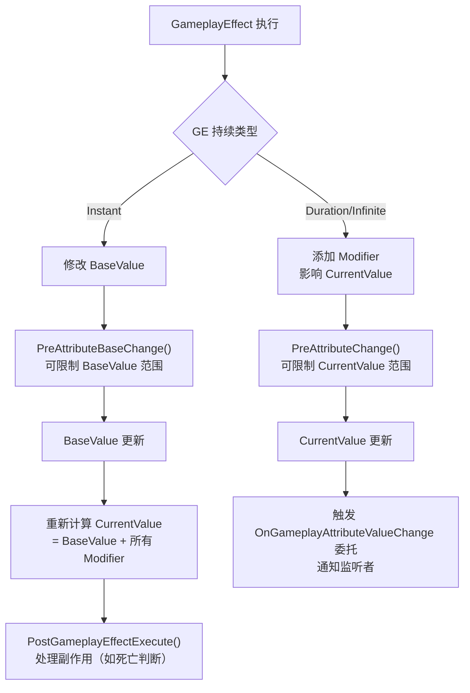

# AttributeSet 属性系统详解

> **源码文件**：`Public/AttributeSet.h`（21.16 KB，571行）
> **继承链**：`UObject → UAttributeSet`

---

## 1. 概述

`UAttributeSet` 是 GAS 中**属性的容器**，用于定义和持有角色的数值属性（如生命值、攻击力、防御力等）。

核心特点：
- 属性以 `FGameplayAttributeData` 结构存储，包含 **BaseValue**（基础值）和 **CurrentValue**（当前值）
- 通过 `ATTRIBUTE_ACCESSORS` 宏自动生成访问器
- 提供 `PreAttributeChange` 和 `PostGameplayEffectExecute` 回调，用于属性修改的拦截和后处理
- 支持网络复制（每个属性单独配置复制）

---

## 2. FGameplayAttributeData：属性数据结构

来源：`Public/AttributeSet.h`

```cpp
USTRUCT(BlueprintType)
struct GAMEPLAYABILITIES_API FGameplayAttributeData
{
    GENERATED_BODY()

    FGameplayAttributeData()
        : BaseValue(0.f)
        , CurrentValue(0.f)
    {}

    FGameplayAttributeData(float DefaultValue)
        : BaseValue(DefaultValue)
        , CurrentValue(DefaultValue)
    {}

    virtual ~FGameplayAttributeData() {}

    // 获取当前值（受 Modifier 影响的最终值）
    float GetCurrentValue() const { return CurrentValue; }

    // 设置当前值（通常由 GAS 内部调用，不要直接调用）
    virtual void SetCurrentValue(float NewValue) { CurrentValue = NewValue; }

    // 获取基础值（不受 Modifier 影响的原始值）
    float GetBaseValue() const { return BaseValue; }

    // 设置基础值（Instant GE 修改的是 BaseValue）
    virtual void SetBaseValue(float NewValue) { BaseValue = NewValue; }

protected:
    UPROPERTY(BlueprintReadOnly, Category = "Attribute")
    float BaseValue;

    UPROPERTY(BlueprintReadOnly, Category = "Attribute")
    float CurrentValue;
};
```

### BaseValue vs CurrentValue 的区别

| 值类型 | 说明 | 何时修改 |
|--------|------|----------|
| **BaseValue** | 属性的基础值，持久存储 | `Instant` 类型 GE 修改 |
| **CurrentValue** | 当前实际值 = BaseValue + 所有激活 Modifier 的叠加 | `Duration/Infinite` 类型 GE 的 Modifier 影响 |

---

## 3. ATTRIBUTE_ACCESSORS 宏

来源：`Public/AttributeSet.h`

这是定义属性时最重要的宏，自动生成 4 个访问器函数：

```cpp
// 宏定义（来源：AttributeSet.h）
#define ATTRIBUTE_ACCESSORS(ClassName, PropertyName) \
    GAMEPLAYATTRIBUTE_PROPERTY_GETTER(ClassName, PropertyName) \
    GAMEPLAYATTRIBUTE_VALUE_GETTER(PropertyName) \
    GAMEPLAYATTRIBUTE_VALUE_SETTER(PropertyName) \
    GAMEPLAYATTRIBUTE_VALUE_INITTER(PropertyName)
```

展开后等价于：

```cpp
// 1. 获取 FGameplayAttribute 对象（用于注册监听、构建 GE 等）
static FGameplayAttribute GetHealthAttribute()
{
    static FProperty* Property = FindFieldChecked<FProperty>(
        UMyAttributeSet::StaticClass(), GET_MEMBER_NAME_CHECKED(UMyAttributeSet, Health)
    );
    return FGameplayAttribute(Property);
}

// 2. 获取当前值
float GetHealth() const { return Health.GetCurrentValue(); }

// 3. 设置当前值（直接设置，不通过 GE）
void SetHealth(float NewVal)
{
    UAbilitySystemComponent* AbilityComp = GetOwningAbilitySystemComponent();
    if (ensure(AbilityComp))
    {
        AbilityComp->SetNumericAttributeBase(GetHealthAttribute(), NewVal);
    }
}

// 4. 初始化值（仅用于初始化，不触发回调）
void InitHealth(float NewVal) { Health.SetBaseValue(NewVal); Health.SetCurrentValue(NewVal); }
```

---

## 4. 定义属性集的完整示例

### 4.1 头文件（.h）

```cpp
UCLASS()
class UMyAttributeSet : public UAttributeSet
{
    GENERATED_BODY()

public:
    UMyAttributeSet();

    // 必须重写：注册网络复制属性
    virtual void GetLifetimeReplicatedProps(
        TArray<FLifetimeProperty>& OutLifetimeProps
    ) const override;

    // 属性修改前回调（用于限制属性范围）
    virtual void PreAttributeChange(
        const FGameplayAttribute& Attribute,
        float& NewValue
    ) override;

    // GE 执行后回调（用于处理属性变化的副作用）
    virtual void PostGameplayEffectExecute(
        const FGameplayEffectModCallbackData& Data
    ) override;

    // ==================== 属性定义 ====================

    // 生命值
    UPROPERTY(BlueprintReadOnly, Category="Attributes", ReplicatedUsing=OnRep_Health)
    FGameplayAttributeData Health;
    ATTRIBUTE_ACCESSORS(UMyAttributeSet, Health)

    // 最大生命值
    UPROPERTY(BlueprintReadOnly, Category="Attributes", ReplicatedUsing=OnRep_MaxHealth)
    FGameplayAttributeData MaxHealth;
    ATTRIBUTE_ACCESSORS(UMyAttributeSet, MaxHealth)

    // 攻击力
    UPROPERTY(BlueprintReadOnly, Category="Attributes", ReplicatedUsing=OnRep_AttackPower)
    FGameplayAttributeData AttackPower;
    ATTRIBUTE_ACCESSORS(UMyAttributeSet, AttackPower)

    // 伤害（临时属性，不复制，用于伤害计算中间值）
    UPROPERTY(BlueprintReadOnly, Category="Attributes")
    FGameplayAttributeData Damage;
    ATTRIBUTE_ACCESSORS(UMyAttributeSet, Damage)

protected:
    // 网络复制回调（必须使用 GAMEPLAYATTRIBUTE_REPNOTIFY 宏）
    UFUNCTION()
    virtual void OnRep_Health(const FGameplayAttributeData& OldHealth);

    UFUNCTION()
    virtual void OnRep_MaxHealth(const FGameplayAttributeData& OldMaxHealth);

    UFUNCTION()
    virtual void OnRep_AttackPower(const FGameplayAttributeData& OldAttackPower);
};
```

### 4.2 实现文件（.cpp）

```cpp
UMyAttributeSet::UMyAttributeSet()
{
    // 可以在构造函数中设置默认值
}

void UMyAttributeSet::GetLifetimeReplicatedProps(
    TArray<FLifetimeProperty>& OutLifetimeProps) const
{
    Super::GetLifetimeReplicatedProps(OutLifetimeProps);

    // 注册需要复制的属性
    DOREPLIFETIME_CONDITION_NOTIFY(UMyAttributeSet, Health, COND_None, REPNOTIFY_Always);
    DOREPLIFETIME_CONDITION_NOTIFY(UMyAttributeSet, MaxHealth, COND_None, REPNOTIFY_Always);
    DOREPLIFETIME_CONDITION_NOTIFY(UMyAttributeSet, AttackPower, COND_None, REPNOTIFY_Always);
    // Damage 不复制，不需要注册
}

void UMyAttributeSet::PreAttributeChange(
    const FGameplayAttribute& Attribute, float& NewValue)
{
    Super::PreAttributeChange(Attribute, NewValue);

    // 限制 Health 在 [0, MaxHealth] 范围内
    if (Attribute == GetHealthAttribute())
    {
        NewValue = FMath::Clamp(NewValue, 0.0f, GetMaxHealth());
    }
    // 限制 MaxHealth 最小为 1
    else if (Attribute == GetMaxHealthAttribute())
    {
        NewValue = FMath::Max(NewValue, 1.0f);
    }
}

void UMyAttributeSet::PostGameplayEffectExecute(
    const FGameplayEffectModCallbackData& Data)
{
    Super::PostGameplayEffectExecute(Data);

    // 处理 Damage 属性（伤害计算完成后，转换为 Health 减少）
    if (Data.EvaluatedData.Attribute == GetDamageAttribute())
    {
        // 获取实际伤害值
        const float LocalDamageDone = GetDamage();
        // 清零 Damage 属性（它只是中间计算值）
        SetDamage(0.f);

        if (LocalDamageDone > 0.f)
        {
            // 将伤害应用到 Health
            const float NewHealth = GetHealth() - LocalDamageDone;
            SetHealth(FMath::Clamp(NewHealth, 0.0f, GetMaxHealth()));

            // 检查是否死亡
            if (GetHealth() <= 0.f)
            {
                // 触发死亡逻辑...
            }
        }
    }
}

// 网络复制回调实现（必须使用此宏）
void UMyAttributeSet::OnRep_Health(const FGameplayAttributeData& OldHealth)
{
    GAMEPLAYATTRIBUTE_REPNOTIFY(UMyAttributeSet, Health, OldHealth);
}

void UMyAttributeSet::OnRep_MaxHealth(const FGameplayAttributeData& OldMaxHealth)
{
    GAMEPLAYATTRIBUTE_REPNOTIFY(UMyAttributeSet, MaxHealth, OldMaxHealth);
}

void UMyAttributeSet::OnRep_AttackPower(const FGameplayAttributeData& OldAttackPower)
{
    GAMEPLAYATTRIBUTE_REPNOTIFY(UMyAttributeSet, AttackPower, OldAttackPower);
}
```

---

## 5. 关键回调函数详解

### 5.1 PreAttributeChange

```cpp
// 在属性值即将改变时调用（CurrentValue 改变前）
// 注意：此时修改 NewValue 可以限制属性范围
// 注意：此回调对 BaseValue 的修改无效，只影响 CurrentValue
virtual void PreAttributeChange(
    const FGameplayAttribute& Attribute,
    float& NewValue
);
```

**重要说明**（来源：`AttributeSet.h` 注释）：
> `PreAttributeChange` 只在 `CurrentValue` 改变时调用，不在 `BaseValue` 改变时调用。
> 如果需要在 `BaseValue` 改变时做处理，应使用 `PostGameplayEffectExecute`。

### 5.2 PostGameplayEffectExecute

```cpp
// 在 GameplayEffect 执行完成后调用（属性已经改变）
// 此时可以安全地读取新值并处理副作用
// 注意：只在服务端调用（Authority）
virtual void PostGameplayEffectExecute(
    const FGameplayEffectModCallbackData& Data
);
```

`FGameplayEffectModCallbackData` 包含：
```cpp
struct FGameplayEffectModCallbackData
{
    // 触发此回调的 GE 规格
    const FGameplayEffectSpec& EffectSpec;

    // 评估后的修改数据（包含属性、操作类型、数值）
    FGameplayModifierEvaluatedData& EvaluatedData;

    // 目标 ASC
    UAbilitySystemComponent& Target;
};
```

### 5.3 PreAttributeBaseChange（来源：`AttributeSet.h`）

```cpp
// 在属性 BaseValue 即将改变时调用
// 可以在此限制 BaseValue 的范围
virtual void PreAttributeBaseChange(
    const FGameplayAttribute& Attribute,
    float& NewValue
) const;
```

---

## 6. 属性初始化

### 6.1 通过 DataTable 初始化

GAS 支持通过 CurveTable 或 DataTable 批量初始化属性：

```cpp
// 在 AbilitySystemGlobals 中配置
// GlobalAttributeSetDefaultsTableNames 指向 CurveTable 资产
// 行名格式：AttributeSetClassName.AttributeName
// 例如：UMyAttributeSet.Health
```

### 6.2 通过 GameplayEffect 初始化（推荐）

```cpp
// 创建一个 Instant 类型的 GE，用于初始化属性
// 在 BeginPlay 时应用
AbilitySystemComponent->ApplyGameplayEffectToSelf(
    InitialAttributesEffect,
    1.0f,
    AbilitySystemComponent->MakeEffectContext()
);
```

---

## 7. AttributeSet 的注册方式

```cpp
// 方式一：在 Actor 构造函数中创建（推荐）
AMyCharacter::AMyCharacter()
{
    AbilitySystemComponent = CreateDefaultSubobject<UAbilitySystemComponent>(TEXT("AbilitySystemComponent"));
    AttributeSet = CreateDefaultSubobject<UMyAttributeSet>(TEXT("AttributeSet"));
    // AttributeSet 会自动注册到 ASC（因为它是 ASC 所在 Actor 的子对象）
}

// 方式二：运行时添加
AbilitySystemComponent->AddAttributeSetSubobject(NewAttributeSet);
```

---

## 8. 属性修改流程



---

## 9. 文档导航

- 上一篇：[03 - GameplayAbility 技能系统](./03_GameplayAbility.md)
- 下一篇：[05 - GameplayEffect 效果系统](./05_GameplayEffect.md)
- 返回：[总目录](./00_GAS学习文档总目录.md)
