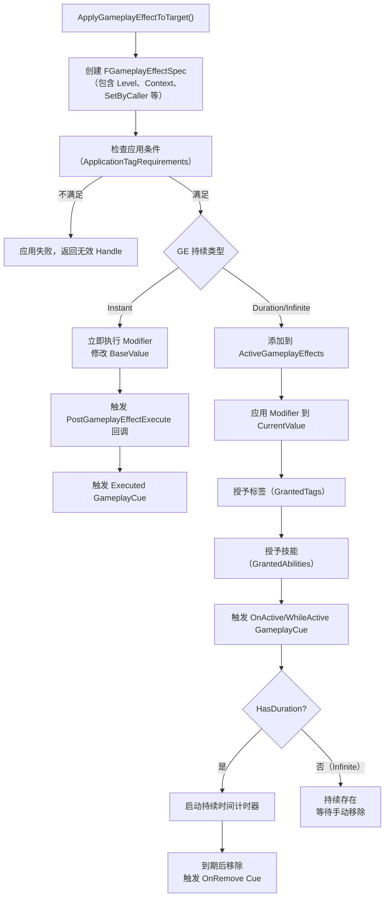

# GameplayEffect 效果系统详解

> **源码文件**：`Public/GameplayEffect.h`（85.41 KB，2082行）、`Public/GameplayEffectTypes.h`（48.92 KB，1704行）
> **继承链**：`UObject → UGameplayEffect`

---

## 1. 概述

`UGameplayEffect`（GE）是 GAS 中**定义数值修改规则的数据资产**。它本身不包含逻辑，只是一个配置数据对象，描述"如何修改属性"。

核心能力：
- **修改属性**：通过 Modifier 对 AttributeSet 中的属性进行加减乘除或覆盖
- **授予标签**：激活时给目标添加 GameplayTag，移除时自动清除
- **授予技能**：激活时给目标授予 GameplayAbility
- **触发 Cue**：激活时触发 GameplayCue（表现层）
- **自定义计算**：通过 ExecutionCalculation 实现复杂的伤害公式
- **堆叠管理**：支持多层叠加，控制叠加策略

---

## 2. GE 持续类型

来源：`Public/GameplayEffect.h`

```cpp
UENUM(BlueprintType)
namespace EGameplayEffectDurationType
{
    enum Type
    {
        // 瞬时效果：立即执行，修改 BaseValue，不在 ActiveGameplayEffects 中保留
        // 适用于：伤害、治疗、一次性属性修改
        Instant,

        // 无限持续：持续存在，直到被手动移除
        // 适用于：永久 Buff、装备加成
        Infinite,

        // 有限持续时间：持续指定时间后自动移除
        // 适用于：临时 Buff/Debuff、冷却效果
        HasDuration,
    };
}
```

### 三种类型的行为差异

| 特性 | Instant | HasDuration | Infinite |
|------|---------|-------------|---------|
| 修改 BaseValue | ✅ | ❌ | ❌ |
| 修改 CurrentValue | ❌ | ✅（持续期间） | ✅（持续期间） |
| 保存在 ActiveGameplayEffects | ❌ | ✅ | ✅ |
| 可以被移除 | ❌（已执行） | ✅（到期自动移除） | ✅（需手动移除） |
| 触发 OnActive/OnRemove Cue | ❌ | ✅ | ✅ |
| 触发 Executed Cue | ✅ | 可选（周期触发） | 可选（周期触发） |

---

## 3. 修改器（Modifier）

修改器定义了 GE 如何修改属性。

### 3.1 FGameplayModifierInfo 结构

来源：`Public/GameplayEffect.h`

```cpp
USTRUCT(BlueprintType)
struct GAMEPLAYABILITIES_API FGameplayModifierInfo
{
    GENERATED_USTRUCT_BODY()

    // 要修改的属性（如 UMyAttributeSet::GetHealthAttribute()）
    UPROPERTY(EditDefaultsOnly, Category=GameplayModifier, meta=(FilterMetaTag="HideFromModifiers"))
    FGameplayAttribute Attribute;

    // 修改操作类型
    UPROPERTY(EditDefaultsOnly, Category=GameplayModifier)
    TEnumAsByte<EGameplayModOp::Type> ModifierOp;

    // 修改数值（支持多种计算方式）
    UPROPERTY(EditDefaultsOnly, Category=GameplayModifier)
    FGameplayEffectModifierMagnitude ModifierMagnitude;

    // 评估通道（用于多层修改器的计算顺序）
    UPROPERTY(EditDefaultsOnly, Category=GameplayModifier)
    FGameplayModEvaluationChannelSettings EvaluationChannelSettings;

    // 此修改器生效的标签需求
    UPROPERTY(EditDefaultsOnly, Category=GameplayModifier)
    FGameplayTagRequirements SourceTags;

    UPROPERTY(EditDefaultsOnly, Category=GameplayModifier)
    FGameplayTagRequirements TargetTags;
};
```

### 3.2 修改操作类型（EGameplayModOp）

来源：`Public/GameplayEffectTypes.h`

```cpp
namespace EGameplayModOp
{
    enum Type
    {
        Additive = 0,    // 加法：CurrentValue += Magnitude
        Multiplicitive,  // 乘法：CurrentValue *= Magnitude（注意：是乘以 Magnitude，不是 1+Magnitude）
        Division,        // 除法：CurrentValue /= Magnitude
        Override,        // 覆盖：CurrentValue = Magnitude（忽略原值）
        Max
    };
}
```

> **注意**：`Multiplicitive` 的计算方式是 `CurrentValue * Magnitude`，而不是 `CurrentValue * (1 + Magnitude)`。如果想实现"增加 20% 攻击力"，Magnitude 应设为 `1.2`，而不是 `0.2`。

### 3.3 修改数值来源（FGameplayEffectModifierMagnitude）

GE 的修改数值支持多种计算方式：

```cpp
UENUM(BlueprintType)
enum class EGameplayEffectMagnitudeCalculation : uint8
{
    // 固定数值（最简单）
    ScalableFloat,

    // 从属性捕获（如：伤害 = 攻击力 * 系数）
    AttributeBased,

    // 自定义计算类（MMC，Modifier Magnitude Calculation）
    CustomCalculationClass,

    // SetByCaller：由调用者在运行时设置数值
    // 通过 GameplayTag 标识，在 ApplyGameplayEffect 前设置
    SetByCaller,
};
```

#### SetByCaller 使用示例

```cpp
// 1. 在 GE 中配置 Modifier，选择 SetByCaller 类型，设置 DataTag
// DataTag: Moe.Effect.SetByCaller.Damage

// 2. 在代码中构建 Spec 并设置数值
FGameplayEffectSpecHandle SpecHandle = AbilitySystemComponent->MakeOutgoingSpec(
    DamageEffectClass, AbilityLevel, EffectContext
);
// 通过 Tag 设置数值
SpecHandle.Data->SetSetByCallerMagnitude(
    FGameplayTag::RequestGameplayTag("Moe.Effect.SetByCaller.Damage"),
    DamageAmount
);
// 应用效果
AbilitySystemComponent->ApplyGameplayEffectSpecToTarget(*SpecHandle.Data, TargetASC);
```

---

## 4. 自定义执行计算（ExecutionCalculation）

当简单的 Modifier 无法满足需求时（如需要同时读取多个属性进行复杂计算），使用 `UGameplayEffectExecutionCalculation`。

### 4.1 属性捕获宏

来源：`Public/GameplayEffectExecutionCalculation.h`

```cpp
// 在 ExecutionCalculation 类中声明属性捕获
#define DECLARE_ATTRIBUTE_CAPTUREDEF(P) \
    FProperty* P##Property; \
    FGameplayEffectAttributeCaptureDefinition P##Def;

// 在构造函数中定义属性捕获
#define DEFINE_ATTRIBUTE_CAPTUREDEF(S, P, T, B) \
{ \
    P##Property = FindFieldChecked<FProperty>(S::StaticClass(), GET_MEMBER_NAME_CHECKED(S, P)); \
    P##Def = FGameplayEffectAttributeCaptureDefinition(P##Property, \
        EGameplayEffectAttributeCaptureSource::T, B); \
}
// T: Source（来源方）或 Target（目标方）
// B: true=快照（应用时捕获），false=实时（执行时捕获）
```

### 4.2 完整实现示例

```cpp
// 伤害计算类
UCLASS()
class UMyDamageExecCalc : public UGameplayEffectExecutionCalculation
{
    GENERATED_BODY()

    // 声明需要捕获的属性
    DECLARE_ATTRIBUTE_CAPTUREDEF(AttackPower);   // 来源方攻击力
    DECLARE_ATTRIBUTE_CAPTUREDEF(Defense);       // 目标方防御力

public:
    UMyDamageExecCalc()
    {
        // 定义属性捕获：从 Source 捕获 AttackPower，快照
        DEFINE_ATTRIBUTE_CAPTUREDEF(UMyAttributeSet, AttackPower, Source, true);
        // 定义属性捕获：从 Target 捕获 Defense，实时
        DEFINE_ATTRIBUTE_CAPTUREDEF(UMyAttributeSet, Defense, Target, false);

        // 注册捕获定义（让 GAS 知道需要捕获哪些属性）
        RelevantAttributesToCapture.Add(AttackPowerDef);
        RelevantAttributesToCapture.Add(DefenseDef);
    }

    virtual void Execute_Implementation(
        const FGameplayEffectCustomExecutionParameters& ExecutionParams,
        OUT FGameplayEffectCustomExecutionOutput& OutExecutionOutput) const override
    {
        FAggregatorEvaluateParameters EvalParams;
        EvalParams.SourceTags = ExecutionParams.GetOwningSpec().CapturedSourceTags.GetAggregatedTags();
        EvalParams.TargetTags = ExecutionParams.GetOwningSpec().CapturedTargetTags.GetAggregatedTags();

        // 获取攻击力
        float AttackPower = 0.f;
        ExecutionParams.AttemptCalculateCapturedAttributeMagnitude(
            AttackPowerDef, EvalParams, AttackPower
        );

        // 获取防御力
        float Defense = 0.f;
        ExecutionParams.AttemptCalculateCapturedAttributeMagnitude(
            DefenseDef, EvalParams, Defense
        );

        // 计算最终伤害
        float FinalDamage = FMath::Max(AttackPower - Defense * 0.5f, 1.0f);

        // 输出修改结果（修改 Damage 属性）
        OutExecutionOutput.AddOutputModifier(
            FGameplayModifierEvaluatedData(
                UMyAttributeSet::GetDamageAttribute(),
                EGameplayModOp::Additive,
                FinalDamage
            )
        );
    }
};
```

---

## 5. 标签授予

GE 激活时可以给目标授予 GameplayTag：

```cpp
// 来源：GameplayEffect.h

// GE 激活时授予，移除时自动清除（最常用）
UPROPERTY(EditDefaultsOnly, BlueprintReadOnly, Category=Tags)
FInheritedTagContainer InheritableOwnedTagsContainer;

// GE 激活时授予，移除时自动清除（仅在 GE 激活期间有效）
UPROPERTY(EditDefaultsOnly, BlueprintReadOnly, Category=Tags)
FGameplayTagContainer DynamicGrantedTags;

// GE 激活时移除目标上的这些标签
UPROPERTY(EditDefaultsOnly, BlueprintReadOnly, Category=Tags)
FInheritedTagContainer RemoveGameplayEffectsWithTags;
```

---

## 6. 技能授予

GE 激活时可以给目标授予 GameplayAbility：

```cpp
// 来源：GameplayEffect.h
// GE 激活时授予技能，GE 移除时自动移除技能
UPROPERTY(EditDefaultsOnly, BlueprintReadOnly, Category=GameplayEffect)
TArray<FGameplayAbilitySpecDef> GrantedAbilities;
```

---

## 7. 堆叠系统

### 7.1 堆叠类型

```cpp
UENUM(BlueprintType)
enum class EGameplayEffectStackingType : uint8
{
    // 不堆叠：每次应用都是独立实例
    None,
    // 按来源堆叠：同一来源的 GE 叠加
    AggregateBySource,
    // 按目标堆叠：同一目标上的 GE 叠加（最常用）
    AggregateByTarget,
};
```

### 7.2 堆叠相关配置

```cpp
// 堆叠类型
UPROPERTY(EditDefaultsOnly, BlueprintReadOnly, Category=Stacking)
EGameplayEffectStackingType StackingType;

// 最大堆叠数
UPROPERTY(EditDefaultsOnly, BlueprintReadOnly, Category=Stacking)
int32 StackLimitCount;

// 达到最大堆叠时的行为
UPROPERTY(EditDefaultsOnly, BlueprintReadOnly, Category=Stacking)
EGameplayEffectStackingDurationPolicy StackDurationRefreshPolicy;

// 堆叠数变化时的行为
UPROPERTY(EditDefaultsOnly, BlueprintReadOnly, Category=Stacking)
EGameplayEffectStackingPeriodPolicy StackPeriodResetPolicy;

// 堆叠数减少时的行为
UPROPERTY(EditDefaultsOnly, BlueprintReadOnly, Category=Stacking)
EGameplayEffectStackingExpirationPolicy StackExpirationPolicy;
```

---

## 8. 周期执行（Periodic）

`HasDuration` 和 `Infinite` 类型的 GE 可以配置周期执行：

```cpp
// 周期执行间隔（秒）
UPROPERTY(EditDefaultsOnly, BlueprintReadOnly, Category=Period)
FScalableFloat Period;

// 是否在应用时立即执行一次
UPROPERTY(EditDefaultsOnly, BlueprintReadOnly, Category=Period)
bool bExecutePeriodicEffectOnApplication;

// 周期执行时的预测策略
UPROPERTY(EditDefaultsOnly, BlueprintReadOnly, Category=Period)
EGameplayEffectPeriodInhibitionRemovedPolicy PeriodicInhibitionPolicy;
```

---

## 9. FGameplayEffectSpec：运行时效果规格

`UGameplayEffect` 是静态数据资产，`FGameplayEffectSpec` 是运行时的实例化数据：

```cpp
struct GAMEPLAYABILITIES_API FGameplayEffectSpec
{
    // 对应的 GE 资产
    TWeakObjectPtr<const UGameplayEffect> Def;

    // 效果上下文（来源信息）
    FGameplayEffectContextHandle EffectContext;

    // 效果等级
    float Level;

    // 持续时间（运行时计算后的值）
    float Duration;

    // 周期（运行时计算后的值）
    float Period;

    // SetByCaller 数值 Map（Tag → 数值）
    TMap<FGameplayTag, float> SetByCallerTagMagnitudes;

    // 捕获的来源标签
    FTagContainerAggregator CapturedSourceTags;

    // 捕获的目标标签
    FTagContainerAggregator CapturedTargetTags;

    // 动态授予的标签
    FGameplayTagContainer DynamicGrantedTags;

    // 动态资产标签
    FGameplayTagContainer DynamicAssetTags;
};
```

---

## 10. FActiveGameplayEffect：激活中的效果

```cpp
struct GAMEPLAYABILITIES_API FActiveGameplayEffect : public FFastArraySerializerItem
{
    // 唯一句柄（用于后续引用和移除）
    FActiveGameplayEffectHandle Handle;

    // 效果规格（包含所有运行时数据）
    FGameplayEffectSpec Spec;

    // 预测键（客户端预测使用）
    FPredictionKey PredictionKey;

    // 开始时间
    float StartServerWorldTime;

    // 客户端开始时间
    float CachedStartServerWorldTime;

    // 开始世界时间
    float StartWorldTime;

    // 是否被抑制（标签条件不满足时暂时失效）
    bool bIsInhibited;

    // 周期执行相关
    float PeriodHandle;
    float StartEffectTime;
};
```

---

## 11. GE 应用完整流程



---

## 12. 文档导航

- 上一篇：[04 - AttributeSet 属性系统](./04_AttributeSet.md)
- 下一篇：[06 - GameplayTag 标签系统](./06_GameplayTag.md)
- 返回：[总目录](./00_GAS学习文档总目录.md)
