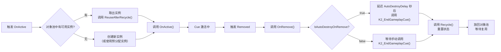

# GameplayCue 表现层系统详解

> **源码文件**：
> - `Public/GameplayCueManager.h`（16.35 KB，380行）
> - `Public/GameplayCueNotify_Static.h`（2.69 KB，69行）
> - `Public/GameplayCueNotify_Actor.h`（6.89 KB，161行）
> - `Public/GameplayEffectTypes.h`（EGameplayCueEvent 定义）

---

## 1. 概述

GameplayCue（GC）是 GAS 的**表现层系统**，负责将游戏逻辑（伤害、Buff 等）与视觉/音效表现解耦。

核心设计原则：
- **逻辑与表现分离**：GameplayEffect 负责数值逻辑，GameplayCue 负责视觉/音效
- **标签驱动**：每个 Cue 通过 `GameplayCueTag`（必须以 `GameplayCue.` 开头）标识
- **自动匹配**：GAS 根据标签层级自动找到最匹配的 Cue 处理器
- **对象池**：`AGameplayCueNotify_Actor` 支持对象回收复用，避免频繁创建销毁

---

## 2. 两种 Cue 通知类型

### 2.1 UGameplayCueNotify_Static（静态 Cue）

来源：`Public/GameplayCueNotify_Static.h`

```cpp
// 非实例化的 UObject，适用于一次性"爆发"效果
// 不能有状态，不能 Tick，不能持续
UCLASS(Blueprintable, meta = (ShowWorldContextPin), hidecategories = (Replication))
class GAMEPLAYABILITIES_API UGameplayCueNotify_Static : public UObject
{
    // 处理 Cue 事件的入口
    virtual void HandleGameplayCue(
        AActor* MyTarget,
        EGameplayCueEvent::Type EventType,
        const FGameplayCueParameters& Parameters
    );

    // 蓝图可实现的通用事件（所有事件类型都会调用）
    UFUNCTION(BlueprintImplementableEvent, Category = "GameplayCueNotify")
    void K2_HandleGameplayCue(
        AActor* MyTarget,
        EGameplayCueEvent::Type EventType,
        const FGameplayCueParameters& Parameters
    ) const;

    // 各事件类型的具体回调（蓝图可重写）
    UFUNCTION(BlueprintNativeEvent, BlueprintPure, Category = "GameplayCueNotify")
    bool OnExecute(AActor* MyTarget, const FGameplayCueParameters& Parameters) const;

    UFUNCTION(BlueprintNativeEvent, BlueprintPure, Category = "GameplayCueNotify")
    bool OnActive(AActor* MyTarget, const FGameplayCueParameters& Parameters) const;

    UFUNCTION(BlueprintNativeEvent, BlueprintPure, Category = "GameplayCueNotify")
    bool WhileActive(AActor* MyTarget, const FGameplayCueParameters& Parameters) const;

    UFUNCTION(BlueprintNativeEvent, BlueprintPure, Category = "GameplayCueNotify")
    bool OnRemove(AActor* MyTarget, const FGameplayCueParameters& Parameters) const;

    // 此 Cue 绑定的标签（必须以 GameplayCue. 开头）
    UPROPERTY(EditDefaultsOnly, Category = GameplayCue, meta=(Categories="GameplayCue"))
    FGameplayTag GameplayCueTag;

    // 是否覆盖父标签的 Cue（true=覆盖，false=叠加调用）
    UPROPERTY(EditDefaultsOnly, Category = GameplayCue)
    bool IsOverride;
};
```

**适用场景**：
- 一次性特效（爆炸、命中闪光）
- 一次性音效（攻击音效、技能音效）
- 不需要持续状态的表现

### 2.2 AGameplayCueNotify_Actor（Actor Cue）

来源：`Public/GameplayCueNotify_Actor.h`

```cpp
// 实例化的 Actor，适用于需要持续状态的效果
// 可以 Tick，可以有状态，支持对象池回收
UCLASS(Blueprintable, meta = (ShowWorldContextPin), hidecategories = (Replication))
class GAMEPLAYABILITIES_API AGameplayCueNotify_Actor : public AActor
{
    // 各事件类型的具体回调（蓝图可重写）
    UFUNCTION(BlueprintNativeEvent, Category = "GameplayCueNotify")
    bool OnExecute(AActor* MyTarget, const FGameplayCueParameters& Parameters);

    UFUNCTION(BlueprintNativeEvent, Category = "GameplayCueNotify")
    bool OnActive(AActor* MyTarget, const FGameplayCueParameters& Parameters);

    UFUNCTION(BlueprintNativeEvent, Category = "GameplayCueNotify")
    bool WhileActive(AActor* MyTarget, const FGameplayCueParameters& Parameters);

    UFUNCTION(BlueprintNativeEvent, Category = "GameplayCueNotify")
    bool OnRemove(AActor* MyTarget, const FGameplayCueParameters& Parameters);

    // ==================== 生命周期管理 ====================

    // GE 移除时是否自动销毁/回收此 Actor
    UPROPERTY(EditDefaultsOnly, Category = Cleanup)
    bool bAutoDestroyOnRemove;

    // 自动销毁延迟时间（秒）
    UPROPERTY(EditAnywhere, Category = Cleanup)
    float AutoDestroyDelay;

    // 手动结束 Cue（触发回收）
    UFUNCTION(BlueprintCallable, Category="GameplayCueNotify")
    virtual void K2_EndGameplayCue();

    // ==================== 对象池支持 ====================

    // 回收到对象池时调用（重置状态）
    // 返回 false 表示此实例不能被回收
    virtual bool Recycle();

    // 从对象池取出复用时调用（撤销 Recycle 中的操作）
    virtual void ReuseAfterRecycle();

    // 预分配实例数量
    UPROPERTY(EditDefaultsOnly, Category = GameplayCue)
    int32 NumPreallocatedInstances;

    // ==================== 实例化策略 ====================

    // 是否为每个施法者创建独立实例
    // 例如：两个玩家同时对同一目标施加光束效果，需要各自的实例
    UPROPERTY(EditDefaultsOnly, Category = GameplayCue)
    bool bUniqueInstancePerInstigator;

    // 是否为每个来源对象创建独立实例
    UPROPERTY(EditDefaultsOnly, Category = GameplayCue)
    bool bUniqueInstancePerSourceObject;

    // 是否允许多次触发 OnActive 事件
    UPROPERTY(EditDefaultsOnly, Category = GameplayCue)
    bool bAllowMultipleOnActiveEvents;

    // 是否允许多次触发 WhileActive 事件
    UPROPERTY(EditDefaultsOnly, Category = GameplayCue)
    bool bAllowMultipleWhileActiveEvents;

    // 是否自动附着到目标 Actor
    UPROPERTY(EditDefaultsOnly, Category = GameplayCue)
    bool bAutoAttachToOwner;

    // 此 Cue 绑定的标签
    UPROPERTY(EditDefaultsOnly, Category=GameplayCue, meta=(Categories="GameplayCue"))
    FGameplayTag GameplayCueTag;

    // 是否覆盖父标签的 Cue
    UPROPERTY(EditDefaultsOnly, Category = GameplayCue)
    bool IsOverride;
};
```

**适用场景**：
- 持续特效（持续燃烧、持续光环）
- 需要附着到目标的效果（跟随目标的粒子）
- 需要 Tick 更新的效果（动态光束）
- 需要状态的效果（需要记录开始位置等）

---

## 3. 两种 Cue 类型对比

| 特性 | UGameplayCueNotify_Static | AGameplayCueNotify_Actor |
|------|--------------------------|--------------------------|
| 基类 | UObject | AActor |
| 实例化 | 不实例化（使用 CDO） | 每次创建实例（支持对象池） |
| 状态 | 无状态 | 有状态 |
| Tick | 不支持 | 支持 |
| 对象池 | 不需要 | 支持（`Recycle`/`ReuseAfterRecycle`） |
| 适用场景 | 一次性效果 | 持续效果 |
| 性能开销 | 极低 | 较高（但有对象池优化） |

---

## 4. Cue 事件类型

来源：`Public/GameplayEffectTypes.h`

```cpp
namespace EGameplayCueEvent
{
    enum Type
    {
        // 触发时机：Duration/Infinite GE 被应用时
        // 对应 Static Cue：OnActive()
        // 对应 Actor Cue：OnActive()
        OnActive,

        // 触发时机：GE 已激活时（用于 Join-in-progress 同步）
        // 当玩家中途加入游戏，需要同步已有的持续效果时触发
        // 对应 Static Cue：WhileActive()
        // 对应 Actor Cue：WhileActive()
        WhileActive,

        // 触发时机：Instant GE 执行时，或 Duration/Infinite GE 的周期执行时
        // 对应 Static Cue：OnExecute()
        // 对应 Actor Cue：OnExecute()
        Executed,

        // 触发时机：Duration/Infinite GE 被移除时
        // 对应 Static Cue：OnRemove()
        // 对应 Actor Cue：OnRemove()
        Removed
    };
}
```

---

## 5. UGameplayCueManager：Cue 管理器

来源：`Public/GameplayCueManager.h`

```cpp
UCLASS()
class GAMEPLAYABILITIES_API UGameplayCueManager : public UDataAsset
{
    // ==================== Cue 分发 ====================

    // 处理 Cue 事件（分发给对应的 Cue 处理器）
    virtual void HandleGameplayCue(
        AActor* TargetActor,
        FGameplayTag GameplayCueTag,
        EGameplayCueEvent::Type EventType,
        const FGameplayCueParameters& Parameters
    );

    // 处理 Cue 事件（使用 Spec）
    virtual void HandleGameplayCues(
        AActor* TargetActor,
        const FGameplayTagContainer& GameplayCueTags,
        EGameplayCueEvent::Type EventType,
        const FGameplayCueParameters& Parameters
    );

    // ==================== 对象库管理 ====================

    // 加载 GameplayCue 对象库（异步）
    virtual void LoadObjectLibraryFromPaths(const TArray<FString>& InPaths);

    // 获取运行时对象库（包含所有已加载的 Cue 通知类）
    UObjectLibrary* GetRuntimeCueObjectLibrary() { return RuntimeGameplayCueObjectLibrary.CueSet; }

    // ==================== 对象池管理 ====================

    // 从对象池获取 Cue Actor（如果有预分配实例）
    AGameplayCueNotify_Actor* GetInstancedCueActor(
        AActor* TargetActor,
        UClass* CueClass,
        const FGameplayCueParameters& Parameters
    );

    // 将 Cue Actor 回收到对象池
    virtual void NotifyGameplayCueActorFinished(AGameplayCueNotify_Actor* Actor);

    // ==================== 全局单例 ====================

    // 获取全局 GameplayCueManager 单例
    static UGameplayCueManager* Get();
};
```

### 5.1 Cue 加载路径配置

在 `DefaultGame.ini` 中配置 Cue 搜索路径：

```ini
[/Script/GameplayAbilities.AbilitySystemGlobals]
; GameplayCue 通知类的搜索路径
GameplayCueNotifyPaths=/Game/GAS/GameplayCues
```

---

## 6. Cue 标签匹配规则

GAS 使用**最长前缀匹配**原则来找到 Cue 处理器：

```
触发标签：GameplayCue.Damage.Physical.Slash

匹配顺序（从最精确到最宽泛）：
1. GameplayCue.Damage.Physical.Slash  ← 最精确匹配
2. GameplayCue.Damage.Physical        ← 次级匹配
3. GameplayCue.Damage                 ← 再次级
4. GameplayCue                        ← 最宽泛

如果 IsOverride = true，找到第一个匹配就停止
如果 IsOverride = false，会继续调用父标签的 Cue
```

---

## 7. Cue 触发方式

### 7.1 通过 GameplayEffect 自动触发

在 GE 资产中配置 `GameplayCues` 数组：

```cpp
// GE 中的 Cue 配置（来源：GameplayEffect.h）
UPROPERTY(EditDefaultsOnly, BlueprintReadOnly, Category = GameplayCue)
TArray<FGameplayEffectCue> GameplayCues;

struct FGameplayEffectCue
{
    // 触发此 Cue 的最小/最大幅度（用于归一化）
    UPROPERTY(EditDefaultsOnly, Category = GameplayCue)
    float MinLevel;

    UPROPERTY(EditDefaultsOnly, Category = GameplayCue)
    float MaxLevel;

    // 触发的 Cue 标签列表
    UPROPERTY(EditDefaultsOnly, Category = GameplayCue, meta=(Categories="GameplayCue"))
    FGameplayTagContainer GameplayCueTags;
};
```

### 7.2 通过代码手动触发

```cpp
// 触发一次性 Cue（Executed 事件）
AbilitySystemComponent->ExecuteGameplayCue(
    FGameplayTag::RequestGameplayTag("GameplayCue.Damage.Physical"),
    EffectContext
);

// 添加持续 Cue（OnActive 事件）
AbilitySystemComponent->AddGameplayCue(
    FGameplayTag::RequestGameplayTag("GameplayCue.Buff.Speed"),
    EffectContext
);

// 移除持续 Cue（Removed 事件）
AbilitySystemComponent->RemoveGameplayCue(
    FGameplayTag::RequestGameplayTag("GameplayCue.Buff.Speed")
);
```

---

## 8. Cue 生命周期流程

```mermaid
flowchart TD
    subgraph "Instant GE 或周期执行"
        A1["GE 执行"] --> B1["触发 Executed 事件"]
        B1 --> C1["GameplayCueManager::HandleGameplayCue\n(EventType=Executed)"]
        C1 --> D1["找到匹配的 Cue 处理器"]
        D1 --> E1["Static: OnExecute()\nActor: OnExecute()"]
    end

    subgraph "Duration/Infinite GE"
        A2["GE 应用"] --> B2["触发 OnActive 事件"]
        B2 --> C2["GameplayCueManager::HandleGameplayCue\n(EventType=OnActive)"]
        C2 --> D2["找到匹配的 Cue 处理器"]
        D2 --> E2["Static: OnActive()\nActor: 创建/复用实例，调用 OnActive()"]
        E2 --> F2["GE 持续期间\n(WhileActive 用于 Join-in-progress)"]
        F2 --> G2["GE 移除时\n触发 Removed 事件"]
        G2 --> H2["Static: OnRemove()\nActor: OnRemove()，然后回收到对象池"]
    end
```



---

## 9. 对象池工作原理



---

## 10. 文档导航

- 上一篇：[06 - GameplayTag 标签系统](./06_GameplayTag.md)
- 下一篇：[08 - AbilityTask 异步任务系统](./08_AbilityTask.md)
- 返回：[总目录](./00_GAS学习文档总目录.md)
