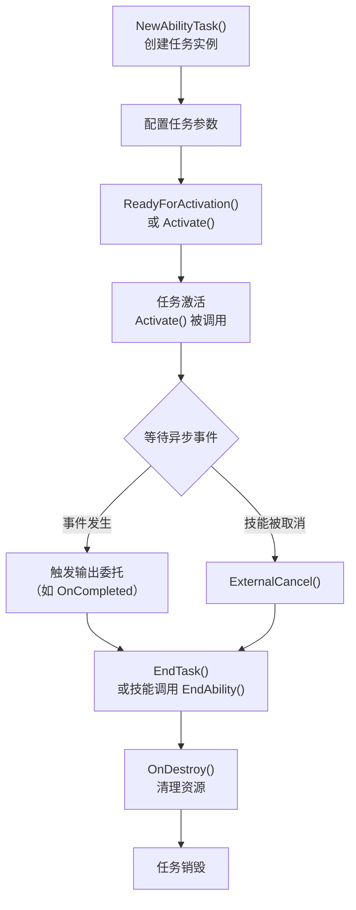

# AbilityTask 异步任务系统详解

> **源码文件**：
> - `Public/Abilities/Tasks/AbilityTask.h`（7.99 KB，209行）
> - `Public/Abilities/Tasks/AbilityTask_PlayMontageAndWait.h`（3.60 KB，94行）
> - `Public/Abilities/Tasks/AbilityTask_WaitGameplayEvent.h`（1.83 KB，53行）
> - `Public/Abilities/Tasks/`（约37个任务类）

---

## 1. 概述

`UAbilityTask` 是 GAS 中**技能内异步操作的基类**，继承自 `UGameplayTask`。它允许技能在执行过程中等待某个异步事件（如动画完成、输入按下、游戏事件等），而不需要阻塞技能的执行流程。

核心特点：
- **异步执行**：任务启动后立即返回，通过委托回调通知完成
- **与技能绑定**：任务的生命周期与所属技能绑定，技能结束时任务自动销毁
- **蓝图友好**：通过静态工厂函数创建，支持蓝图中的异步节点
- **可取消**：支持外部取消（`ExternalCancel`）

---

## 2. UAbilityTask 基类

来源：`Public/Abilities/Tasks/AbilityTask.h`

```cpp
UCLASS(Abstract)
class GAMEPLAYABILITIES_API UAbilityTask : public UGameplayTask
{
    GENERATED_UCLASS_BODY()

    // ==================== 工厂函数模板 ====================

    // 创建任务的模板函数（子类通过静态工厂函数调用此模板）
    template <class T>
    static T* NewAbilityTask(UGameplayAbility* ThisAbility, FName InstanceName = FName())
    {
        check(ThisAbility);
        T* MyObj = NewObject<T>();
        MyObj->InitTask(*ThisAbility, ThisAbility->GetGameplayTaskDefaultPriority());
        MyObj->InstanceName = InstanceName;
        return MyObj;
    }

    // ==================== 生命周期 ====================

    // 任务激活（子类重写，实现具体逻辑）
    virtual void Activate() override;

    // 外部取消（被技能或外部系统取消时调用）
    virtual void ExternalCancel() override;

    // 任务销毁（子类重写，清理资源）
    virtual void OnDestroy(bool bInOwnerFinished) override;

    // ==================== 等待状态 ====================

    // 等待状态枚举
    enum class EAbilityTaskWaitState : uint8
    {
        WaitingOnGame,          // 等待游戏逻辑
        WaitingOnAvatar,        // 等待 Avatar Actor
        WaitingOnUser,          // 等待用户输入
        WaitingOnExternalEvent, // 等待外部事件
    };

    // ==================== 辅助函数 ====================

    // 获取所属技能的 ASC
    UAbilitySystemComponent* GetTargetASC();

    // 获取 AbilitySystemComponent（别名）
    UAbilitySystemComponent* AbilitySystemComponent;

    // 所属技能的弱引用
    TWeakObjectPtr<UGameplayAbility> Ability;

    // 所属技能的 Spec Handle
    FGameplayAbilitySpecHandle AbilitySpecHandle;

    // 所属技能的激活信息
    FGameplayAbilityActivationInfo ActivationInfo;
};
```

### 任务生命周期



---

## 3. 常用任务类详解

### 3.1 AbilityTask_PlayMontageAndWait

来源：`Public/Abilities/Tasks/AbilityTask_PlayMontageAndWait.h`

**功能**：播放动画蒙太奇并等待完成，是最常用的 AbilityTask。

```cpp
UCLASS()
class GAMEPLAYABILITIES_API UAbilityTask_PlayMontageAndWait : public UAbilityTask
{
    // ==================== 输出委托 ====================

    // 蒙太奇正常播放完成
    UPROPERTY(BlueprintAssignable)
    FMontageWaitSimpleDelegate OnCompleted;

    // 蒙太奇开始混出（即将结束）
    UPROPERTY(BlueprintAssignable)
    FMontageWaitSimpleDelegate OnBlendOut;

    // 蒙太奇被其他蒙太奇打断
    UPROPERTY(BlueprintAssignable)
    FMontageWaitSimpleDelegate OnInterrupted;

    // 技能被取消时触发
    UPROPERTY(BlueprintAssignable)
    FMontageWaitSimpleDelegate OnCancelled;

    // ==================== 工厂函数 ====================

    /**
     * 创建播放蒙太奇任务
     * @param TaskInstanceName    任务实例名（用于后续查询）
     * @param MontageToPlay       要播放的蒙太奇
     * @param Rate                播放速率（默认 1.0）
     * @param StartSection        起始段落名（可选）
     * @param bStopWhenAbilityEnds 技能正常结束时是否停止蒙太奇
     * @param AnimRootMotionTranslationScale 根运动缩放（0=禁用根运动）
     * @param StartTimeSeconds    起始时间偏移（秒）
     */
    UFUNCTION(BlueprintCallable, Category="Ability|Tasks",
        meta = (DisplayName="PlayMontageAndWait",
                HidePin = "OwningAbility", DefaultToSelf = "OwningAbility",
                BlueprintInternalUseOnly = "TRUE"))
    static UAbilityTask_PlayMontageAndWait* CreatePlayMontageAndWaitProxy(
        UGameplayAbility* OwningAbility,
        FName TaskInstanceName,
        UAnimMontage* MontageToPlay,
        float Rate = 1.f,
        FName StartSection = NAME_None,
        bool bStopWhenAbilityEnds = true,
        float AnimRootMotionTranslationScale = 1.f,
        float StartTimeSeconds = 0.f
    );

    virtual void Activate() override;
    virtual void ExternalCancel() override;
    virtual void OnDestroy(bool AbilityEnded) override;
};
```

**使用示例**：
```cpp
void UMyAttackAbility::ActivateAbility(...)
{
    // 创建任务
    UAbilityTask_PlayMontageAndWait* MontageTask =
        UAbilityTask_PlayMontageAndWait::CreatePlayMontageAndWaitProxy(
            this,           // 所属技能
            NAME_None,      // 任务名
            AttackMontage,  // 蒙太奇资产
            1.0f,           // 播放速率
            NAME_None,      // 起始段落
            true            // 技能结束时停止蒙太奇
        );

    // 绑定回调
    MontageTask->OnCompleted.AddDynamic(this, &UMyAttackAbility::OnMontageCompleted);
    MontageTask->OnBlendOut.AddDynamic(this, &UMyAttackAbility::OnMontageBlendOut);
    MontageTask->OnInterrupted.AddDynamic(this, &UMyAttackAbility::OnMontageInterrupted);
    MontageTask->OnCancelled.AddDynamic(this, &UMyAttackAbility::OnMontageCancelled);

    // 激活任务（必须调用！）
    MontageTask->ReadyForActivation();
}

void UMyAttackAbility::OnMontageCompleted()
{
    EndAbility(CurrentSpecHandle, CurrentActorInfo, CurrentActivationInfo, true, false);
}
```

---

### 3.2 AbilityTask_WaitGameplayEvent

来源：`Public/Abilities/Tasks/AbilityTask_WaitGameplayEvent.h`

**功能**：等待指定 GameplayTag 的游戏事件，常用于技能内的事件驱动逻辑（如等待动画通知触发伤害）。

```cpp
UCLASS()
class GAMEPLAYABILITIES_API UAbilityTask_WaitGameplayEvent : public UAbilityTask
{
    // 事件触发时的委托（携带事件数据）
    UPROPERTY(BlueprintAssignable)
    FWaitGameplayEventDelegate EventReceived;

    /**
     * 等待指定 GameplayTag 事件
     * @param EventTag              要等待的事件标签
     * @param OptionalExternalTarget 可选：监听其他 Actor 的事件（默认监听自身）
     * @param OnlyTriggerOnce       是否只触发一次（true=触发后自动结束任务）
     * @param OnlyMatchExact        是否精确匹配标签（false=匹配子标签也触发）
     */
    UFUNCTION(BlueprintCallable, Category = "Ability|Tasks",
        meta = (HidePin = "OwningAbility", DefaultToSelf = "OwningAbility",
                BlueprintInternalUseOnly = "TRUE"))
    static UAbilityTask_WaitGameplayEvent* WaitGameplayEvent(
        UGameplayAbility* OwningAbility,
        FGameplayTag EventTag,
        AActor* OptionalExternalTarget = nullptr,
        bool OnlyTriggerOnce = false,
        bool OnlyMatchExact = true
    );

    virtual void Activate() override;
    virtual void GameplayEventCallback(const FGameplayEventData* Payload);
    void OnDestroy(bool AbilityEnding) override;
};
```

**使用示例**（等待动画通知触发伤害）：
```cpp
void UMyAttackAbility::ActivateAbility(...)
{
    // 播放蒙太奇
    UAbilityTask_PlayMontageAndWait* MontageTask = ...;
    MontageTask->ReadyForActivation();

    // 等待伤害触发事件（由动画通知发送）
    UAbilityTask_WaitGameplayEvent* EventTask =
        UAbilityTask_WaitGameplayEvent::WaitGameplayEvent(
            this,
            FGameplayTag::RequestGameplayTag("Moe.GAS.GameEvent.HitConfirm"),
            nullptr,    // 监听自身
            false,      // 可以多次触发（连击）
            true        // 精确匹配
        );

    EventTask->EventReceived.AddDynamic(this, &UMyAttackAbility::OnHitConfirm);
    EventTask->ReadyForActivation();
}

void UMyAttackAbility::OnHitConfirm(FGameplayEventData Payload)
{
    // 在此处应用伤害效果
    ApplyGameplayEffectToTarget(...);
}
```

---

### 3.3 其他常用任务类

来源：`Public/Abilities/Tasks/` 目录（约37个任务类）

| 任务类 | 功能 |
|--------|------|
| `AbilityTask_WaitInputPress` | 等待输入按下 |
| `AbilityTask_WaitInputRelease` | 等待输入释放 |
| `AbilityTask_WaitConfirmCancel` | 等待确认或取消输入 |
| `AbilityTask_WaitDelay` | 等待指定时间 |
| `AbilityTask_WaitAttributeChange` | 等待属性值变化 |
| `AbilityTask_WaitAttributeChangeThreshold` | 等待属性超过/低于阈值 |
| `AbilityTask_WaitGameplayTagAdded` | 等待标签被添加 |
| `AbilityTask_WaitGameplayTagRemoved` | 等待标签被移除 |
| `AbilityTask_WaitGameplayEffectApplied` | 等待 GE 被应用 |
| `AbilityTask_WaitGameplayEffectRemoved` | 等待 GE 被移除 |
| `AbilityTask_WaitMovementModeChange` | 等待移动模式变化 |
| `AbilityTask_WaitOverlap` | 等待碰撞重叠 |
| `AbilityTask_WaitTargetData` | 等待目标数据（配合 TargetActor 使用） |
| `AbilityTask_SpawnActor` | 生成 Actor |
| `AbilityTask_ApplyRootMotionConstantForce` | 应用恒定根运动力 |
| `AbilityTask_ApplyRootMotionJumpForce` | 应用跳跃根运动力 |
| `AbilityTask_ApplyRootMotionMoveToActorForce` | 根运动移动到目标 Actor |
| `AbilityTask_ApplyRootMotionMoveToForce` | 根运动移动到指定位置 |
| `AbilityTask_ApplyRootMotionRadialForce` | 应用径向根运动力 |
| `AbilityTask_NetworkSyncPoint` | 网络同步点（等待服务端/客户端同步） |
| `AbilityTask_VisualizeTargeting` | 可视化目标选择 |

---

## 4. 自定义 AbilityTask

### 4.1 创建自定义任务

```cpp
// 头文件
DECLARE_DYNAMIC_MULTICAST_DELEGATE_OneParam(FMyCustomTaskDelegate, float, Value);

UCLASS()
class UAbilityTask_MyCustomTask : public UAbilityTask
{
    GENERATED_BODY()

public:
    // 输出委托
    UPROPERTY(BlueprintAssignable)
    FMyCustomTaskDelegate OnSuccess;

    UPROPERTY(BlueprintAssignable)
    FMyCustomTaskDelegate OnFailed;

    // 工厂函数（蓝图调用入口）
    UFUNCTION(BlueprintCallable, Category = "Ability|Tasks",
        meta = (HidePin = "OwningAbility", DefaultToSelf = "OwningAbility",
                BlueprintInternalUseOnly = "TRUE"))
    static UAbilityTask_MyCustomTask* CreateMyCustomTask(
        UGameplayAbility* OwningAbility,
        float Duration
    );

    virtual void Activate() override;
    virtual void OnDestroy(bool bInOwnerFinished) override;

private:
    float Duration;
    FTimerHandle TimerHandle;

    void OnTimerComplete();
};

// 实现文件
UAbilityTask_MyCustomTask* UAbilityTask_MyCustomTask::CreateMyCustomTask(
    UGameplayAbility* OwningAbility, float Duration)
{
    // 使用基类模板创建实例
    UAbilityTask_MyCustomTask* Task =
        NewAbilityTask<UAbilityTask_MyCustomTask>(OwningAbility);
    Task->Duration = Duration;
    return Task;
}

void UAbilityTask_MyCustomTask::Activate()
{
    Super::Activate();

    // 启动计时器
    GetWorld()->GetTimerManager().SetTimer(
        TimerHandle,
        this,
        &UAbilityTask_MyCustomTask::OnTimerComplete,
        Duration,
        false
    );
}

void UAbilityTask_MyCustomTask::OnTimerComplete()
{
    // 触发成功委托
    if (ShouldBroadcastAbilityTaskDelegates())
    {
        OnSuccess.Broadcast(Duration);
    }
    EndTask();
}

void UAbilityTask_MyCustomTask::OnDestroy(bool bInOwnerFinished)
{
    // 清理计时器
    if (GetWorld())
    {
        GetWorld()->GetTimerManager().ClearTimer(TimerHandle);
    }
    Super::OnDestroy(bInOwnerFinished);
}
```

---

## 5. 注意事项

### 5.1 必须调用 ReadyForActivation()

```cpp
// 创建任务后，必须调用 ReadyForActivation() 才能激活
// 否则任务不会执行
Task->ReadyForActivation();
```

### 5.2 ShouldBroadcastAbilityTaskDelegates()

```cpp
// 在触发委托前，必须检查此函数
// 如果技能已经结束，不应该再触发委托
if (ShouldBroadcastAbilityTaskDelegates())
{
    OnCompleted.Broadcast();
}
```

### 5.3 任务与技能的生命周期关系

- 技能调用 `EndAbility()` 时，所有关联的 AbilityTask 会自动调用 `OnDestroy(true)`
- 任务调用 `EndTask()` 时，只销毁该任务，不影响技能
- 如果技能使用 `NonInstanced` 策略，**不能使用** AbilityTask（因为没有实例）

---

## 6. 文档导航

- 上一篇：[07 - GameplayCue 表现层系统](./07_GameplayCue.md)
- 下一篇：[09 - 预测系统](./09_预测系统.md)
- 返回：[总目录](./00_GAS学习文档总目录.md)
