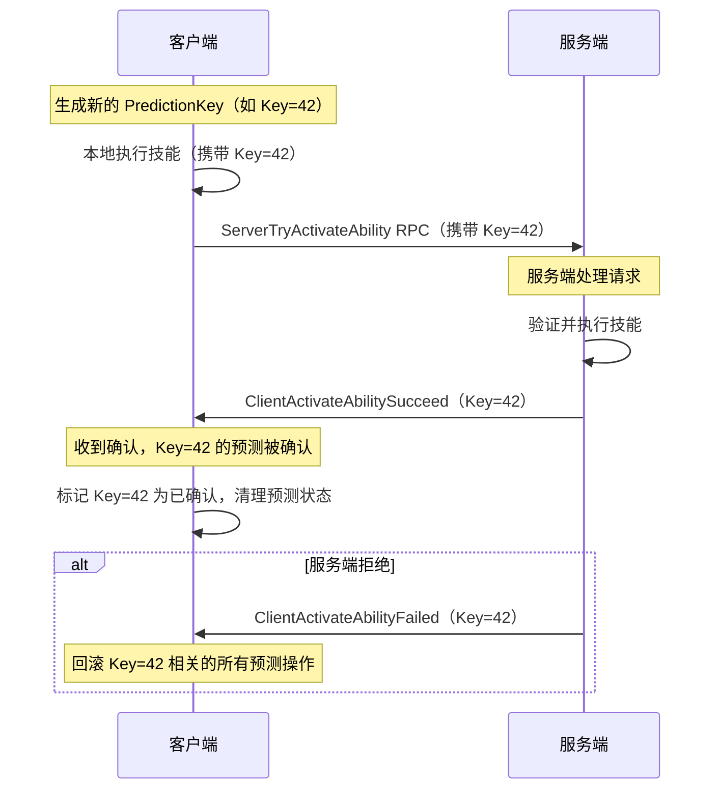
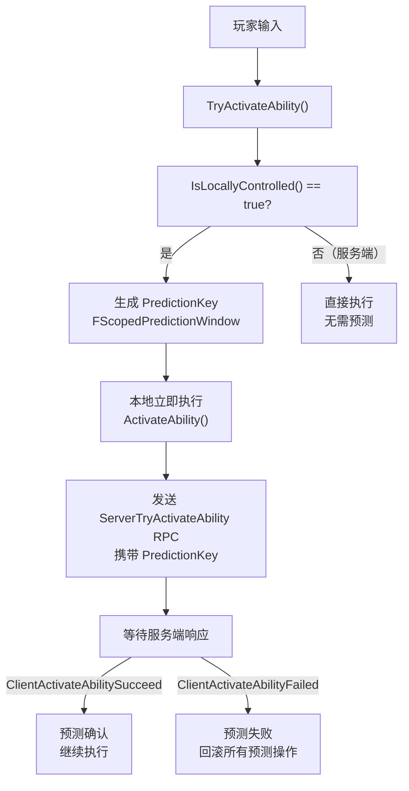
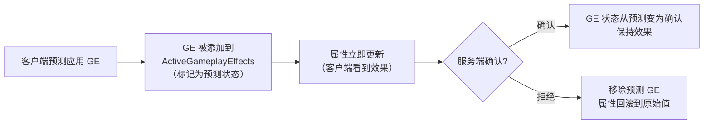
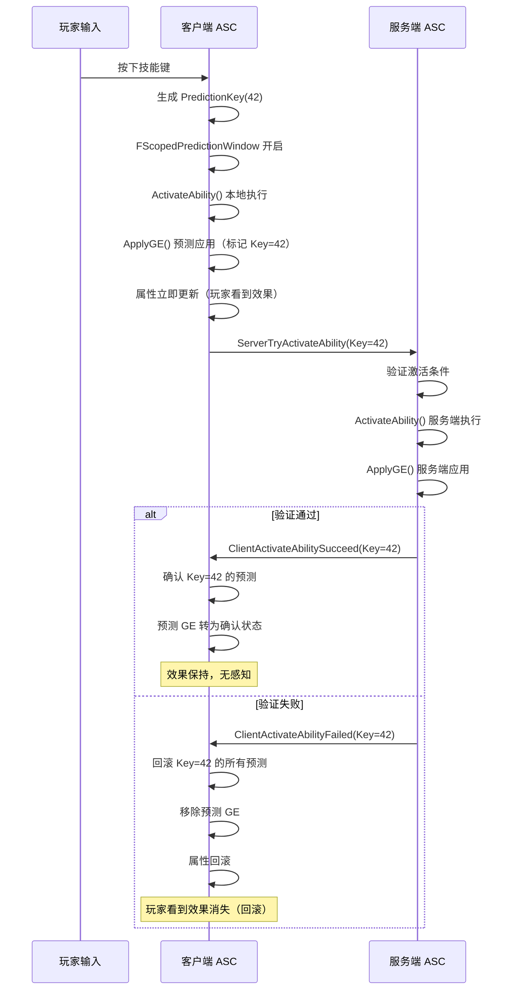

# GAS 预测系统（Prediction）详解

> **源码文件**：`Public/GameplayPrediction.h`（29.13 KB，566行）
> **注意**：此文件包含大量 Epic 工程师的详细注释，是理解 GAS 预测机制的权威文档

---

## 1. 概述

GAS 的预测系统允许**客户端在不等待服务端确认的情况下立即执行技能**，从而消除网络延迟带来的操作不流畅感。服务端随后验证客户端的预测，并在必要时进行回滚。

来源：`GameplayPrediction.h` 注释（Epic 原文）：
> "The ability system prediction system is designed to allow clients to predict ability activation and gameplay effect application without waiting for the server to confirm."

---

## 2. 核心概念：FPredictionKey

来源：`Public/GameplayPrediction.h`

```cpp
USTRUCT(BlueprintType)
struct GAMEPLAYABILITIES_API FPredictionKey
{
    GENERATED_USTRUCT_BODY()

    typedef int16 KeyType;

    FPredictionKey()
        : Current(0)
        , Base(0)
        , bIsServerInitiated(false)
        , bIsStale(false)
    {}

    // 当前预测键值（非零表示有效）
    UPROPERTY()
    KeyType Current;

    // 基础键值（用于依赖链）
    UPROPERTY()
    KeyType Base;

    // 是否是服务端发起的预测
    UPROPERTY()
    bool bIsServerInitiated;

    // 是否已过期（服务端已处理）
    bool bIsStale;

    // 创建新的预测键
    static FPredictionKey CreateNewPredictionKey(UAbilitySystemComponent* OwningComponent);

    // 创建依赖于当前键的子键
    FPredictionKey CreateNewChildKey() const;

    // 检查键是否有效
    bool IsValidKey() const { return Current != 0; }

    // 检查是否是本地客户端生成的键
    bool IsLocalClientKey() const { return !bIsServerInitiated && Current > 0; }

    // 检查是否是服务端生成的键
    bool IsServerInitiatedKey() const { return bIsServerInitiated; }
};
```

### 预测键的工作原理



---

## 3. FScopedPredictionWindow：预测窗口

来源：`Public/GameplayPrediction.h`

```cpp
/**
 * 预测窗口的 RAII 包装器
 * 在构造时创建预测键，在析构时清理
 *
 * 来源注释（Epic 原文）：
 * "A scoped prediction window is used to group together a set of predictions
 *  that should all be rolled back together if the prediction fails."
 */
struct GAMEPLAYABILITIES_API FScopedPredictionWindow
{
    // 构造函数：创建新的预测键并设置到 ASC
    FScopedPredictionWindow(
        UAbilitySystemComponent* AbilitySystemComponent,
        bool bCanGenerateNewKey = true
    );

    // 构造函数：使用已有的预测键
    FScopedPredictionWindow(
        UAbilitySystemComponent* AbilitySystemComponent,
        FPredictionKey InPredictionKey,
        bool bSetReplicatedPredictionKey = false
    );

    // 析构函数：清理预测窗口
    ~FScopedPredictionWindow();

private:
    TWeakObjectPtr<UAbilitySystemComponent> Owner;
    bool bClearScopedPredictionKey;
    bool bSetReplicatedPredictionKey;
};
```

**使用示例**：
```cpp
// 在技能激活时创建预测窗口
void UMyAbility::ActivateAbility(...)
{
    // 创建预测窗口（自动管理预测键的生命周期）
    FScopedPredictionWindow ScopedPrediction(
        GetAbilitySystemComponentFromActorInfo()
    );

    // 在此窗口内的所有操作都会被预测
    ApplyGameplayEffectToOwner(...);
    // 窗口析构时自动清理
}
```

---

## 4. 预测系统的工作流程

来源：`GameplayPrediction.h` 注释（Epic 原文详细说明）

### 4.1 客户端预测激活流程



### 4.2 预测的 GameplayEffect

当客户端预测应用 GE 时：



---

## 5. 预测键的依赖链

来源：`GameplayPrediction.h` 注释

```cpp
/**
 * 预测键可以形成依赖链：
 * 如果父键被拒绝，所有依赖于父键的子键也会被拒绝
 *
 * 例如：
 * Key=1（技能激活）
 *   └── Key=1.1（技能内应用的 GE）
 *         └── Key=1.1.1（GE 触发的 Cue）
 *
 * 如果 Key=1 被拒绝，Key=1.1 和 Key=1.1.1 也会被回滚
 */
```

---

## 6. 服务端发起的预测

来源：`GameplayPrediction.h`

```cpp
/**
 * 服务端也可以发起预测（ServerInitiated）
 * 这用于服务端主动激活技能并通知客户端的场景
 *
 * 流程：
 * 1. 服务端生成 ServerInitiated PredictionKey
 * 2. 服务端执行技能
 * 3. 服务端通知客户端（携带 PredictionKey）
 * 4. 客户端使用此 Key 执行本地预测
 */
```

---

## 7. HasAuthorityOrPredictionKey

来源：`AbilitySystemComponent.h`

```cpp
// 检查是否有权限执行操作（服务端权威 或 有有效预测键）
// 这是 GAS 中最常用的权限检查函数
bool HasAuthorityOrPredictionKey(
    const FGameplayAbilityActivationInfo* ActivationInfo
) const;
```

**使用场景**：
```cpp
// 在技能中，只有服务端或有预测键的客户端才能应用 GE
if (HasAuthorityOrPredictionKey(ActivationInfo))
{
    ApplyGameplayEffectToOwner(...);
}
```

---

## 8. 预测系统的限制

来源：`GameplayPrediction.h` 注释（Epic 原文）

> "Not everything can be predicted. The following things cannot be predicted:
> - Spawning actors (use GameplayCue for visual effects instead)
> - Random numbers (use a seeded random with the prediction key)
> - Anything that requires server-side state that the client doesn't have"

**不能预测的操作**：
1. **生成 Actor**：客户端不应预测生成 Actor（改用 GameplayCue 实现视觉效果）
2. **随机数**：需要使用基于预测键的种子随机数
3. **需要服务端状态的操作**：客户端没有的服务端数据

---

## 9. 预测相关的 ASC 配置

```cpp
// 来源：AbilitySystemGlobals.h
// 是否允许客户端预测对非本地目标的 GE 应用
// 默认 false（只预测对自身的效果）
UPROPERTY(config)
bool PredictTargetGameplayEffects;
```

---

## 10. 预测系统完整流程图



---

## 11. 文档导航

- 上一篇：[08 - AbilityTask 异步任务系统](./08_AbilityTask.md)
- 下一篇：[10 - AbilitySystemGlobals 全局配置](./10_AbilitySystemGlobals.md)
- 返回：[总目录](./00_GAS学习文档总目录.md)
