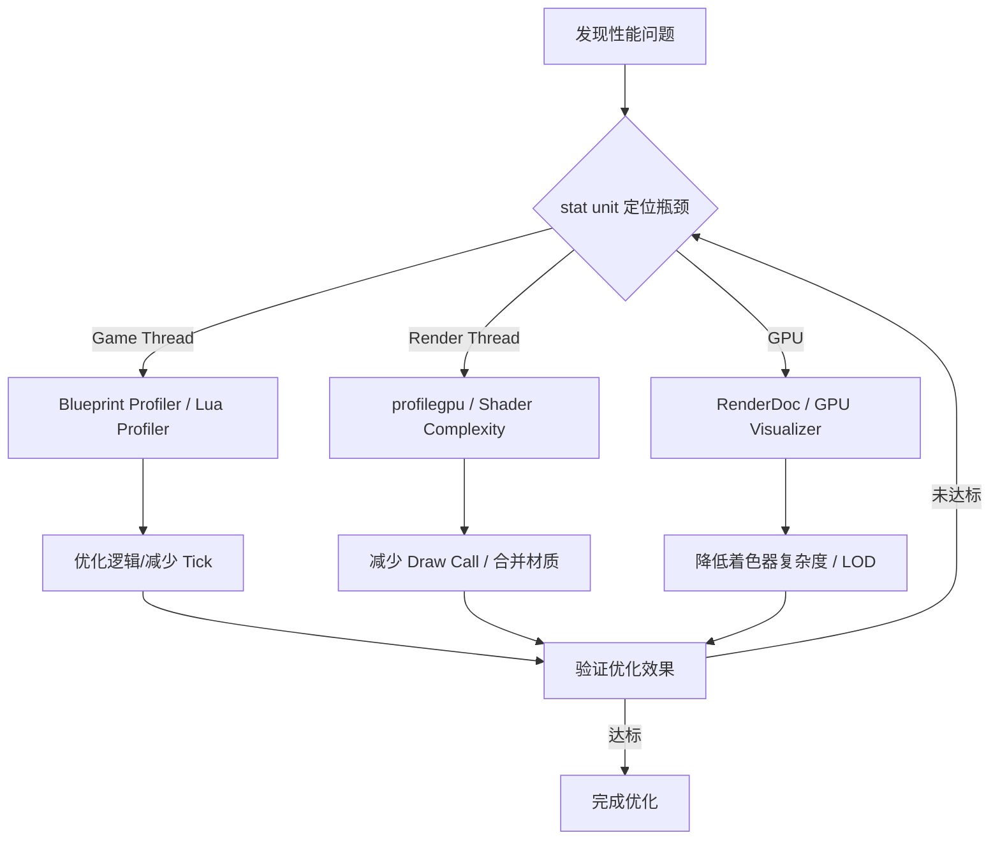

# UE4 性能优化工具

UE4（Unreal Engine 4）提供了一套丰富的内置性能分析与优化工具，以下是主要工具的分类介绍：

---

## 1. CPU 性能分析

### **Unreal Insights**
- UE4.25+ 引入的新一代性能分析工具，替代旧版 Profiler
- 支持 CPU Timing、内存、文件 I/O 等多维度分析
- 通过 `-trace=cpu,frame,bookmark` 启动参数启用
- 可独立运行，支持远程分析

### **Stat 命令（控制台命令）**
| 命令 | 说明 |
|------|------|
| `stat unit` | 显示总帧时间、Game 线程、Render 线程、GPU 时间 |
| `stat fps` | 显示帧率 |
| `stat game` | 显示游戏逻辑耗时 |
| `stat scenerendering` | 显示场景渲染各阶段耗时 |
| `stat memory` | 显示内存使用统计 |
| `stat particles` | 显示粒子系统性能 |
| `stat animation` | 显示动画系统耗时 |
| `stat startfile` / `stat stopfile` | 录制性能数据文件（.ue4stats） |

### **Session Frontend Profiler**
- 位于 **Window → Developer Tools → Session Frontend**
- 可以查看帧时间线、函数调用图
- 支持录制和回放分析数据

---

## 2. GPU 性能分析

### **GPU Visualizer（GPU 可视化器）**
- 控制台输入 `profilegpu` 或快捷键 `Ctrl+Shift+,`
- 显示每个渲染 Pass 的 GPU 耗时
- 可展开查看各阶段详细时间

### **RenderDoc 集成**
- UE4 内置 RenderDoc 插件
- 可逐帧抓取 GPU 绘制调用
- 分析 Draw Call、Shader 耗时、资源绑定等

### **r.xxx 渲染相关控制台变量**
```
r.ScreenPercentage        -- 屏幕分辨率百分比
r.ViewDistanceScale       -- 视距缩放
r.Shadow.MaxResolution    -- 阴影最大分辨率
r.PostProcessAAQuality    -- 后处理抗锯齿质量
```

---

## 3. 内存分析

### **Memreport**
- 控制台输入 `memreport -full`
- 导出详细内存报告（纹理、网格、对象等分类统计）

### **Memory Insights**
- Unreal Insights 的内存追踪模块
- 启动参数 `-trace=memory`
- 可追踪内存分配/释放热点

### **Obj List / Obj Refs**
- `obj list` — 列出所有 UObject 及其数量和内存占用
- `obj refs` — 查看对象引用关系，排查内存泄漏

---

## 4. 场景与资源优化

### **Optimization Viewmodes（优化视图模式）**
在编辑器视口中切换查看：
- **Shader Complexity** — 着色器复杂度热力图
- **Light Complexity** — 光照复杂度
- **Lightmap Density** — 光照贴图密度
- **Wireframe** — 线框模式查看面数
- **Quad Overdraw** — 过度绘制检测

### **Statistics 窗口**
- **Window → Statistics**
- 统计场景中的三角面、顶点、光源、Actor 数量等

### **LOD 和 HLOD**
- **Hierarchical LOD（HLOD）** — 将远处多个 Actor 合并为简化网格
- LOD 预览工具：可在编辑器中逐级切换查看

---

## 5. 网络性能分析

### **Network Profiler**
- 分析网络带宽使用、RPC 调用频率、属性复制开销
- 通过 `stat net` 查看基本网络统计

---

## 6. 蓝图性能分析

### **Blueprint Profiler**
- 位于蓝图编辑器 → **Window → Blueprint Profiler**
- 精确到每个蓝图节点的执行耗时
- 帮助定位高消耗蓝图逻辑

---

## 7. Lua 性能分析（项目相关）

根据你们项目的 LetsGoPlugins 中的工具：

### **ProjectGLuaProfiler**
- 项目内置的 Lua 性能分析插件
- 用于分析 Lua 脚本的函数调用耗时和热点

---

## 8. 第三方/NVIDIA 集成

| 工具 | 说明 |
|------|------|
| **NVIDIA DLSS** | 深度学习超级采样，提升画面质量和帧率 |
| **NVIDIA NIS** | 图像缩放锐化技术 |
| **NVIDIA Reflex** | 低延迟技术，减少输入延迟 |
| **Intel GPA / AMD RGP** | 各平台 GPU 性能分析工具 |

---

## 常用优化工作流



---

## 小贴士

1. **先用 `stat unit` 确定瓶颈在 Game/Render/GPU 哪一端**，再选择对应工具深入分析
2. **Unreal Insights** 是目前最推荐的综合性能分析工具，功能全面且开销小
3. 优化时遵循 **测量→分析→优化→验证** 的循环，避免盲目优化


客户端系统开发中最常使用的是哪款性能分析工具?
	在 UE4 客户端系统开发中，**最常使用的性能分析工具是 `Unreal Insights`**。让我结合项目实际情况和知识库做进一步说明。
	[ ]
	[ ]
	根据项目知识库的检索结果，结合 LetsGo 项目的实际实践，我来总结一下客户端系统开发中最常使用的性能分析工具：

	---

	# 客户端系统开发最常用的性能分析工具

	在 UE4 客户端系统开发中，**最常用的性能分析工具是 `stat unit` 控制台命令**，它是日常开发中快速定位性能瓶颈的第一选择。但在项目维度上，LetsGo 项目集成了一套 **多层级的性能分析工具体系**，不同场景使用不同工具：

	---

	## 🥇 日常最高频：`stat unit`

	这是客户端开发者使用频率最高的工具，只需在控制台输入即可实时查看：

	| 指标 | 说明 |
	|------|------|
	| **Frame** | 总帧时间 |
	| **Game** | Game Thread（游戏逻辑线程）耗时 |
	| **Draw** | Render Thread（渲染线程）耗时 |
	| **GPU** | GPU 渲染耗时 |

	> **核心价值**：一键判断瓶颈在 **Game线程 / Render线程 / GPU** 哪一端，是所有后续深入分析的起点。

	---

	## 🥈 综合深度分析：`Unreal Insights`

	根据项目文档记载，LetsGo 项目的性能监控集成了 **PerfDog 和 Unreal Insights** 工具，提供线程时间、渲染数据、Lua 内存使用等关键指标实时监控。

	**Unreal Insights** 是 UE4.25+ 推出的新一代综合性能分析工具，通过 `-trace=cpu,frame,bookmark` 启动参数启用，特点是：
	- 开销极低，适合真机分析
	- 支持 CPU Timing、内存、文件 I/O 等多维度
	- 可独立运行、远程分析

	---

	## 🥉 项目内置工具体系

	根据 LetsGo 项目的知识库，项目集成了 **三层性能监控与分析工具**：

	### 1. C++ 层：PerfBox + PerformanceCollector + ShaderComplexity

	```mermaid
	flowchart TD
		A[PerfBox] -->|每帧回调| B[GatherCPUData + GatherMemoryData]
		B --> C[异步写入 + 压缩报告]
		
		D[PerformanceCollector] -->|EPerfDataType枚举| E[Frame/RHI/Render/Memory数据]
		E --> F[Lua脚本接口 + 异步存档]
		
		G[ShaderComplexity] --> H[着色器指令采集]
		H --> I[HUD可视化展示]
	```

	- **PerfBox**：单例模式管理，Start/Stop 控制采集，支持异步写入和压缩报告
	- **PerformanceCollector**：采集帧时间、RHI时间、渲染时间、内存等数据，**集成 Lua 接口**
	- **ShaderComplexity**：实时采集着色器指令数，HUD 可视化展示渲染热点

	### 2. Lua 层：Profiler + LuaMemLeakCheckModel

	- **Profiler.lua**：通过 `profiler_hook_wrapper_by_call` 调试钩子实现无侵入性能监控，支持函数调用次数、执行时间、内存变化的分析和报告生成
	- **LuaMemLeakCheckModel.lua**：基于快照对比机制定位 Lua 内存泄漏
	- **FPSManager.lua**：动态画质自适应系统，根据帧率数据自动降低画质等级

	### 3. 插件层：ProjectGLuaProfiler

	- 项目自研的 **Lua 性能分析插件**，专门针对 Lua 脚本的函数调用耗时和热点进行分析

	---

	## 📊 使用频率排序

	| 排名 | 工具 | 使用场景 | 使用频率 |
	|------|------|---------|---------|
	| 1 | `stat unit` | 日常开发快速定位瓶颈方向 | ⭐⭐⭐⭐⭐ |
	| 2 | `Unreal Insights` | 深度分析 CPU/内存/IO | ⭐⭐⭐⭐ |
	| 3 | `PerformanceCollector` + [`PerfBox`](command:gongfeng.gongfeng-copilot.chat.open-relative-path?%7B%22%24mid%22%3A1%2C%22fsPath%22%3A%22g%3A%5C%5CLetsGoDevelop%5C%5CLetsGo%5C%5CPlugins%5C%5CTMRDC%5C%5CCommon%5C%5CUnLua%5C%5CIntermediate%5C%5CIntelliSense%5C%5CPerfBox%22%2C%22_sep%22%3A1%2C%22path%22%3A%22%2FG%3A%2FLetsGoDevelop%2FLetsGo%2FPlugins%2FTMRDC%2FCommon%2FUnLua%2FIntermediate%2FIntelliSense%2FPerfBox%22%2C%22scheme%22%3A%22file%22%7D) | 项目内置性能数据采集 | ⭐⭐⭐⭐ |
	| 4 | `Profiler.lua` | Lua 层函数耗时分析 | ⭐⭐⭐ |
	| 5 | `profilegpu` | GPU 渲染 Pass 分析 | ⭐⭐⭐ |
	| 6 | `LuaMemLeakCheckModel` | Lua 内存泄漏排查 | ⭐⭐ |
	| 7 | `ShaderComplexity` | 着色器复杂度可视化 | ⭐⭐ |

	---

	## 总结

	**一句话回答**：客户端系统开发中最常使用的是 **`stat unit`**——它是性能分析的"第一诊断工具"，帮助开发者在几秒内判断瓶颈所在（Game/Render/GPU），再根据瓶颈方向选用 Unreal Insights、Profiler.lua、profilegpu 等工具做深入分析。在 LetsGo 项目中，还额外集成了 PerfBox/PerformanceCollector 等自研性能采集工具链，与 Lua Profiler 形成了 **C++层 + Lua层** 的完整性能监控体系。