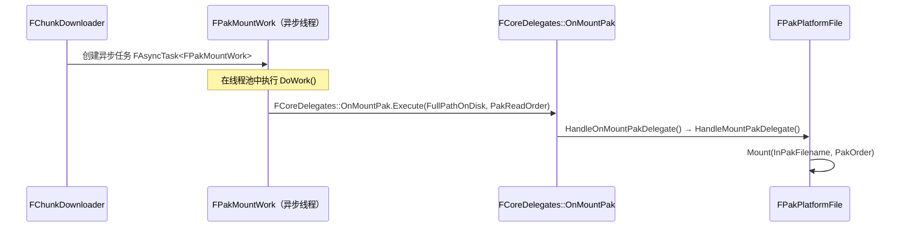
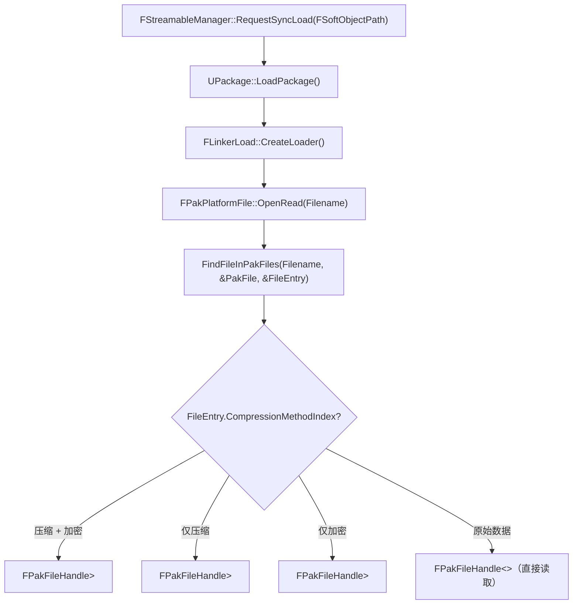
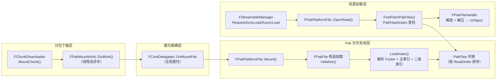

[任务规划完成]
这是一个关于 UE4 底层 .pak 文件解析和加载机制的好问题。让我从 `ChunkDownloader.cpp` 和相关引擎源码中找到完整的加载链路。
找到了关键代码，`FCoreDelegates::OnMountPak` 是核心挂载入口。让我继续深入查找 pak 文件的解析逻辑。

---

## .pak 文件在游戏中的解析与加载流程

整个过程分为三个阶段：**触发挂载 → 解析文件格式 → 运行时读取资源**。

---

## 一、触发挂载：从 ChunkDownloader 到 FPakPlatformFile



`ChunkDownloader` 本身不直接操作 pak 文件，而是通过 **`FCoreDelegates::OnMountPak`** 这个全局委托来解耦，`FPakPlatformFile` 在初始化时绑定了这个委托：

```cpp
// IPlatformFilePak.cpp 第 7979 行
FCoreDelegates::OnMountPak.BindRaw(this, &FPakPlatformFile::HandleOnMountPakDelegate);
FCoreDelegates::MountPak.BindRaw(this, &FPakPlatformFile::HandleMountPakDelegate);
```

---

## 二、.pak 文件格式解析（`FPakFile::Initialize` + `LoadIndex`）

### 2.1 .pak 文件的物理结构

```
┌─────────────────────────────────────────────────────┐
│                  资源数据区（Payload）                  │
│  [File1 Data][File2 Data][File3 Data]...             │
│  （可压缩：Zlib/Gzip/Oodle，可加密：AES）              │
├─────────────────────────────────────────────────────┤
│                  主索引（Primary Index）               │
│  MountPoint + NumEntries + PathHashSeed              │
│  + EncodedPakEntries（每个文件的 Offset/Size/Hash）   │
│  + PathHashIndex 偏移/大小/Hash                       │
│  + FullDirectoryIndex 偏移/大小/Hash                  │
├─────────────────────────────────────────────────────┤
│              路径哈希索引（PathHashIndex）              │
│  FName Hash → FPakEntryLocation（快速查找）            │
├─────────────────────────────────────────────────────┤
│            完整目录索引（FullDirectoryIndex）           │
│  TMap<目录路径, TMap<文件名, FPakEntryLocation>>       │
├─────────────────────────────────────────────────────┤
│                  文件尾（Footer / FPakInfo）           │
│  Magic(4B) + Version(4B) + IndexOffset(8B)          │
│  + IndexSize(8B) + IndexHash(20B) + EncryptedFlag   │
│  + EncryptionKeyGuid + CompressionMethods           │
└─────────────────────────────────────────────────────┘
                        ↑ 从文件末尾开始读取
```

### 2.2 解析步骤详解

**Step 1：从文件末尾读取 Footer（`FPakInfo`）**

```cpp
// 从文件末尾反向定位 Footer 的位置
FileInfoPos = CachedTotalSize - Info.GetSerializedSize(CompatibleVersion);
Reader->Seek(FileInfoPos);
Info.Serialize(*Reader, CompatibleVersion);

// 验证魔数
if (Info.Magic == FPakInfo::PakFile_Magic)  // 0x1B6A32F1
{
    bShouldLoad = true;
}
```

Footer 包含：
- `Magic`：`0x1B6A32F1`，用于验证文件合法性
- `Version`：pak 格式版本（当前最新 v13，元梦定制了 `ZplanEncrypted`）
- `IndexOffset` / `IndexSize`：主索引在文件中的位置
- `IndexHash`：主索引的 SHA1，用于完整性校验
- `bEncryptedIndex`：索引是否加密
- `EncryptionKeyGuid`：加密密钥 GUID
- `CompressionMethods`：该 pak 使用的压缩算法列表

**Step 2：加载并验证主索引（`LoadIndexInternal`）**

```cpp
// 跳转到主索引位置，读取原始字节
Reader->Seek(Info.IndexOffset);
PrimaryIndexData.SetNum(Info.IndexSize);
Reader->Serialize(PrimaryIndexData.GetData(), Info.IndexSize);

// 解密（如果加密）+ SHA1 校验
DecryptAndValidateIndex(Reader, PrimaryIndexData, Info.IndexHash, ComputedHash);

// 从主索引中读取关键数据
PrimaryIndexReader << PathHashSeed;    // 路径哈希种子
PrimaryIndexReader << NumEntries;      // 文件总数
PrimaryIndexReader << MountPoint;      // 挂载点路径（如 "../../../Game/"）
PrimaryIndexReader << EncodedPakEntries; // 所有文件的压缩元数据
```

**Step 3：加载二级索引（PathHashIndex 或 FullDirectoryIndex）**

根据运行时配置决定加载哪种索引：

| 索引类型 | 数据结构 | 内存占用 | 用途 |
|---|---|---|---|
| `PathHashIndex` | `TMap<uint64 Hash, FPakEntryLocation>` | 小（仅哈希值） | 运行时快速查找（默认） |
| `FullDirectoryIndex` | `TMap<目录, TMap<文件名, Location>>` | 大（完整路径字符串） | 目录遍历、编辑器 |

```cpp
// 运行时默认只加载 PathHashIndex，节省内存
bWillUsePathHashIndex = !bWillUseFullDirectoryIndex;
```

---

## 三、运行时资源读取（`FPakPlatformFile::OpenRead`）

当 `FStreamableManager` 请求加载某个资源时，最终会调用到 `FPakPlatformFile::OpenRead`：



**`FindFileInPakFiles` 的查找过程：**

```cpp
// 遍历所有已挂载的 pak（按 ReadOrder 排序，高优先级先查）
for (FPakListEntry& Entry : PakFiles)
{
    // 用 PathHashIndex 快速查找（O(1) 哈希查找）
    const FPakEntryLocation* Location = Entry.PakFile->FindPrunedFileInIndex(Filename);
    if (Location)
    {
        // 解码 EncodedPakEntries 得到 FPakEntry（含 Offset/Size/Hash）
        OutEntry = DecodeEntry(*Location);
        return true;
    }
}
```

**`FPakFileHandle` 读取数据的过程：**

```cpp
// 以压缩+加密为例（FPakCompressedReaderPolicy<FPakSimpleEncryption>）
// 1. 根据 FPakEntry.Offset 定位到 pak 文件中的数据块
// 2. 按 CompressionBlocks 分块读取（每块最大 64KB）
// 3. AES 解密（如果加密）
// 4. 解压缩（Zlib/Gzip/Oodle）
// 5. 返回原始字节流给上层 FLinkerLoad
```

---

## 四、完整调用链总结



---

## 五、元梦之星的定制扩展

从代码注释可以看到，元梦在标准 UE4 pak 格式上做了两处定制（`TMRDC-inversenie` / `Z1-wuxianglin`）：

| 定制点 | 说明 |
|---|---|
| `PakFile_Version_ZplanCustom (v12)` | 在 Footer 中增加了 `FZplanEngineVersion`，用于引擎版本兼容性校验，防止旧版本 pak 被新引擎错误加载 |
| `PakFile_Version_ZplanEncrypted (v13)` | 在 `FPakEntry` 的 `Offset` 字段位置插入随机数混淆，增加逆向难度（`PakEntry_Magic = 0x709665BA`） |
| `OutErrorCode` 参数 | 在 `Mount`/`LoadIndex` 全链路增加了精细化错误码（`EPME_FailurePakIntegrityError` 等），方便线上问题定位 |