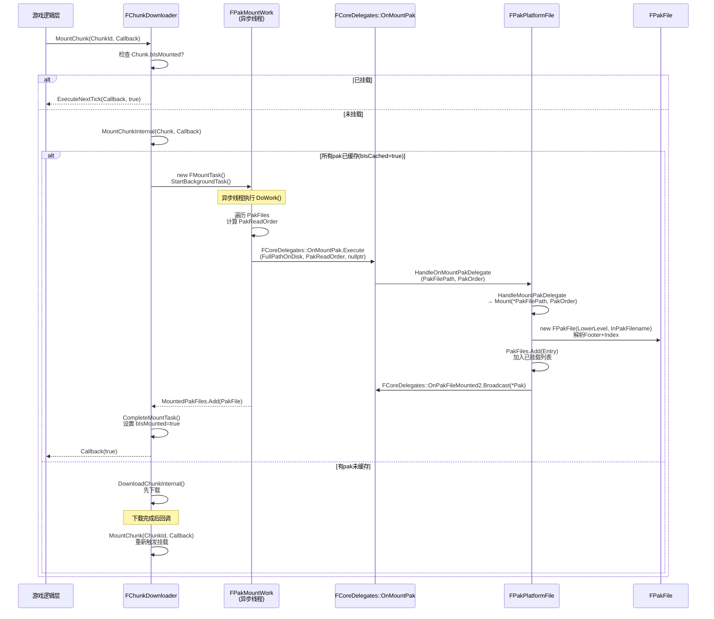

[任务规划完成]
我来分析 `.pak` 资源的挂载触发流程，从 `ChunkDownloader` 到实际挂载的完整链路。
现在我已经有了完整的调用链路，可以给出全面的分析。

---

## .pak 资源挂载的完整触发流程

整个挂载过程分为 **5个阶段**，跨越 `ChunkDownloader` → `FCoreDelegates` → `FPakPlatformFile` 三个模块。

---

## 完整调用链路图



---

## 阶段一：`MountChunk` — 入口判断（主线程）

**文件**：[ChunkDownloader.cpp](/G:/LetsGoDevelop/ue4_tracking_rdcsp/Engine/Plugins/Runtime/ChunkDownloader/Source/Private/ChunkDownloader.cpp)（第 1782 行）

```cpp
void FChunkDownloader::MountChunk(int32 ChunkId, const FCallback& Callback)
{
    TSharedRef<FChunk>* ChunkPtr = Chunks.Find(ChunkId);
    
    if (Chunk.bIsMounted)
    {
        ExecuteNextTick(Callback, true);  // 已挂载，直接回调
        return;
    }
    MountChunkInternal(Chunk, Callback); // 进入挂载流程
}
```

---

## 阶段二：`MountChunkInternal` — 决策分支（主线程）

有两条路径：

**路径A：所有 pak 已缓存（`bIsCached=true`）→ 直接启动异步挂载任务**

```cpp
// 创建异步任务
Chunk.MountTask = new FMountTask();
FPakMountWork& MountWork = Chunk.MountTask->GetTask();
MountWork.CacheFolder = CacheFolder;
for (const TSharedRef<FPakFile>& PakFile : Chunk.PakFiles)
{
    if (!PakFile->bIsMounted)
        MountWork.PakFiles.Add(PakFile);  // 只挂载未挂载的pak
}
Chunk.MountTask->StartBackgroundTask();  // 🚀 启动异步线程

// 启动每帧Ticker轮询挂载结果
MountTicker = FTicker::GetCoreTicker().AddTicker(
    FTickerDelegate::CreateSP(this, &FChunkDownloader::UpdateMountTasks)
);
```

**路径B：有 pak 未缓存 → 先下载，下载完成后再触发挂载**

```cpp
DownloadChunkInternal(Chunk, [WeakThisPtr, ChunkId, Callback](bool bDownloadSuccess) {
    if (bDownloadSuccess)
    {
        SharedThis->MountChunk(ChunkId, Callback);  // 下载完成后重新触发挂载
    }
}, MAX_int32);
```

---

## 阶段三：`FPakMountWork::DoWork` — 实际挂载（异步线程）

```cpp
void DoWork()
{
    uint32 PakReadOrder = PakFiles.Num();  // 读取优先级（倒序，保证顺序挂载）
    for (const TSharedRef<FPakFile>& PakFile : PakFiles)
    {
        FString FullPathOnDisk = (PakFile->bIsEmbedded ? EmbeddedFolder : CacheFolder) 
                                  / PakFile->Entry.FileName;
        
        // 🔑 通过委托触发实际挂载
        bool bMountOk = FCoreDelegates::OnMountPak.Execute(FullPathOnDisk, PakReadOrder, nullptr);
        
        if (bMountOk)
        {
            MountedPakFiles.Add(PakFile);  // 记录成功挂载的pak
            --PakReadOrder;
        }
    }
}
```

> **关键设计**：`PakReadOrder` 从 `PakFiles.Num()` 开始递减，确保 Chunk 内的 pak 文件按**顺序优先级**挂载（序号越小的 pak 优先级越高）。

---

## 阶段四：`FPakPlatformFile::Mount` — 底层挂载（异步线程）

**委托绑定**（`FPakPlatformFile::Initialize` 第 7979 行）：
```cpp
// 引擎启动时绑定，将委托指向 FPakPlatformFile
FCoreDelegates::OnMountPak.BindRaw(this, &FPakPlatformFile::HandleOnMountPakDelegate);
```

**实际挂载逻辑**（第 8120 行）：

```cpp
bool FPakPlatformFile::Mount(const TCHAR* InPakFilename, uint32 PakOrder, ...)
{
    // 1. 打开文件句柄
    TSharedPtr<IFileHandle> PakHandle = LowerLevel->OpenRead(InPakFilename);
    
    // 2. 解析 pak 文件（读取 Footer + Index）
    FPakFileThreadSafePtr Pak = MakeShared<FPakFile>(LowerLevel, InPakFilename, ...);
    
    if (Pak->IsValid())
    {
        // 3. 检查加密Key是否已注册
        if (!Pak->GetInfo().EncryptionKeyGuid.IsValid() || HasKey(EncryptionKeyGuid))
        {
            // 4. 加入已挂载列表（线程安全）
            FScopeLock ScopedLock(&PakListCritical);
            FPakListEntry Entry;
            Entry.ReadOrder = PakOrder;
            Entry.PakFile = Pak;
            PakFiles.Add(Entry);
            PakFiles.StableSort();  // 按优先级排序
            bPakSuccess = true;
        }
        else
        {
            // 加密Key未就绪 → 加入延迟挂载队列
            PendingEncryptedPakFiles.Add(...);
        }
        
        // 5. 挂载 IoStore（.utoc/.ucas 容器）
        FIoDispatcher::Get().Mount(IoStoreEnvironment, EncryptionKeyGuid, EncryptionKey);
        
        // 6. 广播挂载完成通知
        FCoreDelegates::OnPakFileMounted2.Broadcast(*Pak);
    }
}
```

---

## 阶段五：`CompleteMountTask` — 回到主线程完成收尾

每帧 Ticker 轮询 `UpdateMountTasks`，检测到异步任务完成后：

```cpp
void FChunkDownloader::CompleteMountTask(FChunk& Chunk)
{
    // 更新每个 pak 的 bIsMounted 状态
    for (const TSharedRef<FPakFile>& PakFile : MountWork.MountedPakFiles)
    {
        PakFile->bIsMounted = true;
    }
    
    // 更新 Chunk 整体挂载状态
    Chunk.bIsMounted = bAllPaksMounted;
    
    // 触发 OnChunkMounted 广播（供外部监听）
    OnChunkMounted.Broadcast(Chunk.ChunkId, Chunk.bIsMounted);
    
    // 触发业务回调
    for (const auto& Callback : MountWork.PostMountCallbacks)
        Callback(Chunk.bIsMounted);
}
```

---

## 关键设计总结

| 设计点 | 说明 |
|---|---|
| **委托解耦** | `ChunkDownloader` 通过 `FCoreDelegates::OnMountPak` 委托调用挂载，不直接依赖 `FPakPlatformFile` |
| **异步挂载** | `FPakMountWork` 在后台线程执行，避免阻塞游戏主线程 |
| **Ticker 轮询** | 主线程通过每帧 Ticker 检测异步任务完成，保证回调在主线程执行 |
| **顺序优先级** | `PakReadOrder` 递减确保同一 Chunk 内 pak 文件按正确顺序覆盖 |
| **加密延迟挂载** | 若加密 Key 未就绪，pak 进入 `PendingEncryptedPakFiles` 队列，Key 注册后自动补挂 |
| **下载→挂载串联** | 未缓存时先下载，下载完成回调中再次调用 `MountChunk`，形成完整的下载→挂载链路 |