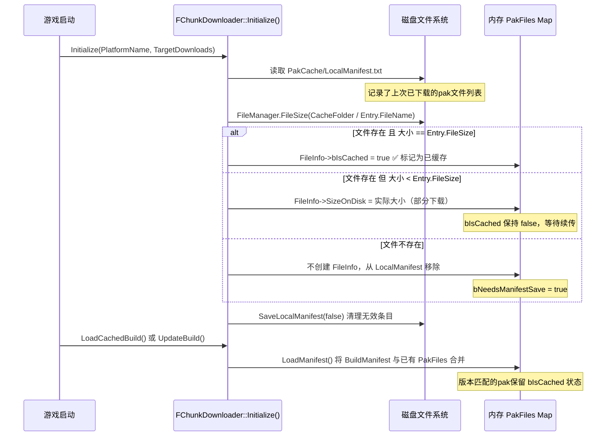
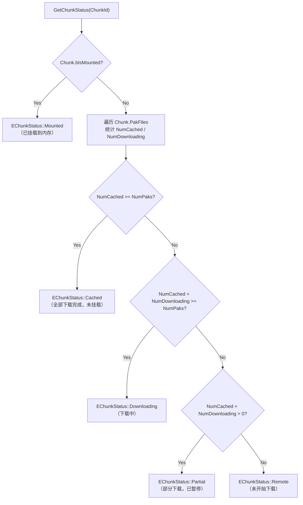

[任务规划完成]
这是一个很好的问题，涉及到游戏重启后如何恢复下载状态。让我深入分析 `ChunkDownloader.cpp` 中的持久化机制。
现在我已经有了完整的代码链路，可以给出全面准确的分析。

---

## Chunk 下载状态的标记与持久化机制

核心设计思路：**内存状态（`bIsCached`/`bIsMounted`）是运行时的，持久化状态靠磁盘上的 `LocalManifest.txt` 文件**。游戏重启后通过读取该文件 + 校验磁盘文件大小来恢复状态。

---

## 一、状态的两个层次

### 1. 运行时内存状态（`FPakFile` 结构体）

```cpp
// ChunkDownloader.h
struct FPakFile
{
    FPakFileEntry Entry;      // 元数据（FileName, FileSize, FileVersion, ChunkId）
    bool bIsCached = false;   // ✅ pak文件是否已完整下载到磁盘
    bool bIsMounted = false;  // ✅ pak文件是否已挂载到内存文件系统
    bool bIsEmbedded = false; // 是否是随包内置的pak
    uint64 SizeOnDisk = 0;    // 磁盘上的实际文件大小（下载中会增长）
    TSharedPtr<FDownload> Download; // 正在进行的下载任务
};
```

### 2. 持久化磁盘状态（`LocalManifest.txt`）

存储路径：`FPaths::ProjectPersistentDownloadDir() / "PakCache/LocalManifest.txt"`

文件格式（Tab 分隔的文本）：
```
$NUM_ENTRIES = 3
GameplayA_001.pak	102400	v1.4.22-r23928	-1	/
GameplayA_002.pak	204800	v1.4.22-r23928	-1	/
GameplayB_001.pak	512000	v1.4.22-r23928	-1	/
```

---

## 二、游戏重启后的状态恢复流程



**关键代码（`Initialize` 函数，第 445-507 行）：**

```cpp
// 1. 读取 LocalManifest.txt（记录了上次已下载的文件列表）
TArray<FPakFileEntry> LocalManifest = ParseManifest(CacheFolder / LOCAL_MANIFEST);

for (const FPakFileEntry& Entry : LocalManifest)
{
    TSharedRef<FPakFile> FileInfo = MakeShared<FPakFile>();
    FileInfo->Entry = Entry;

    FString LocalPath = CacheFolder / Entry.FileName;
    int64 SizeOnDiskInt = FileManager.FileSize(*LocalPath);  // 2. 检查磁盘实际大小
    
    if (SizeOnDiskInt > 0)
    {
        FileInfo->SizeOnDisk = (uint64)SizeOnDiskInt;
        
        // 3. 大小完全匹配 → 认为已完整下载
        if (FileInfo->SizeOnDisk == Entry.FileSize)
        {
            FileInfo->bIsCached = true;  // ✅ 恢复已缓存状态
        }
        PakFiles.Add(Entry.FileName, FileInfo);
    }
    // 文件不存在 → 从 LocalManifest 清除（可能是崩溃前未完成）
}
```

---

## 三、`LocalManifest.txt` 的写入时机

`bNeedsManifestSave = true` 的触发点 → 最终调用 `SaveLocalManifest(false)` 写盘：

| 触发时机 | 代码位置 |
|---|---|
| 下载任务**开始**时（`IssueDownloads`） | 第 1603 行 |
| 下载**完成**后（`OnCompleted`） | 第 1723 行 |
| `UpdateBuild` 加载新 BuildManifest 时 | 第 1408 行 |
| `ValidateCache` 删除损坏文件后 | 第 976 行 |
| `FlushCache` 清理缓存后 | 第 907 行 |
| `Finalize` 退出时 | 第 1778/1808/1863 行 |

**`SaveLocalManifest` 写入条件**（第 659-674 行）：
```cpp
// 只写入：非内置(bIsEmbedded=false) 且 (已有磁盘数据 OR 正在下载中) 的pak
if (!It.Value->bIsEmbedded)
{
    if (It.Value->SizeOnDisk > 0 || It.Value->Download.IsValid())
    {
        // 写入一行：FileName \t FileSize \t FileVersion \t -1 \t /
        PakFileText += FString::Printf(TEXT("%s\t%llu\t%s\t-1\t/\n"), ...);
    }
}
```

> **注意**：`LocalManifest.txt` 只记录"已开始下载"的文件，**不记录 `bIsCached` 字段本身**。重启后通过**文件大小校验**来重新推断 `bIsCached`。

---

## 四、`GetChunkStatus` 如何计算 Chunk 状态



---

## 五、完整的状态生命周期总结

```
首次下载：
Remote → (DownloadChunk) → Downloading → (下载完成) → Cached → (MountChunk) → Mounted

游戏重启后：
磁盘有完整pak → Initialize() 读取 LocalManifest → bIsCached=true → Cached（无需重新下载）
磁盘有部分pak → Initialize() 读取 LocalManifest → SizeOnDisk>0 但 bIsCached=false → Partial（支持断点续传）
磁盘无pak文件 → LocalManifest 条目被清除 → Remote（需要重新下载）
```

**关键结论**：`bIsMounted` 是**纯内存状态**，游戏重启后永远从 `false` 开始，必须重新调用 `MountChunk` 才能恢复挂载。而 `bIsCached` 则通过 `LocalManifest.txt` + 磁盘文件大小校验来持久化恢复，这就是为什么已下载的玩法资源在重启后不需要重新下载的原因。