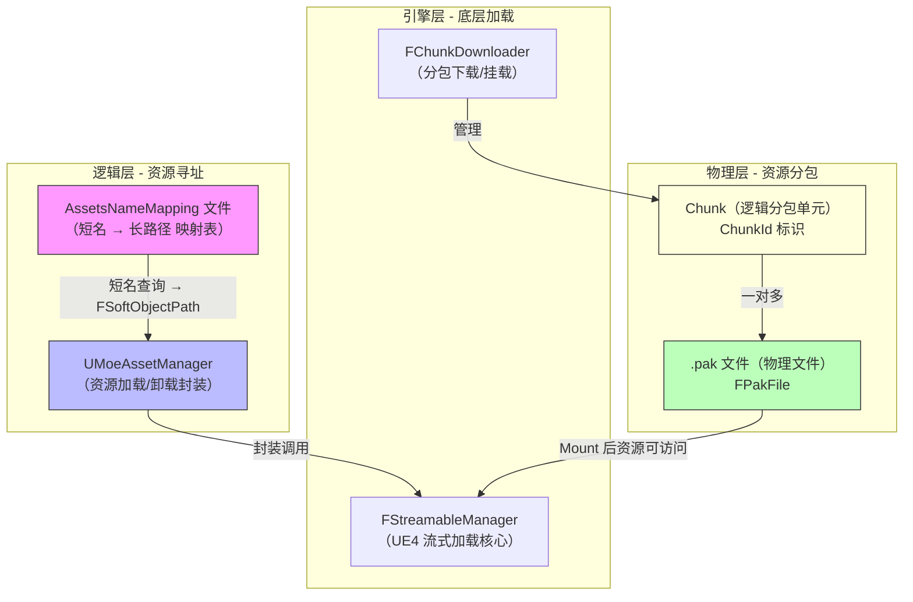
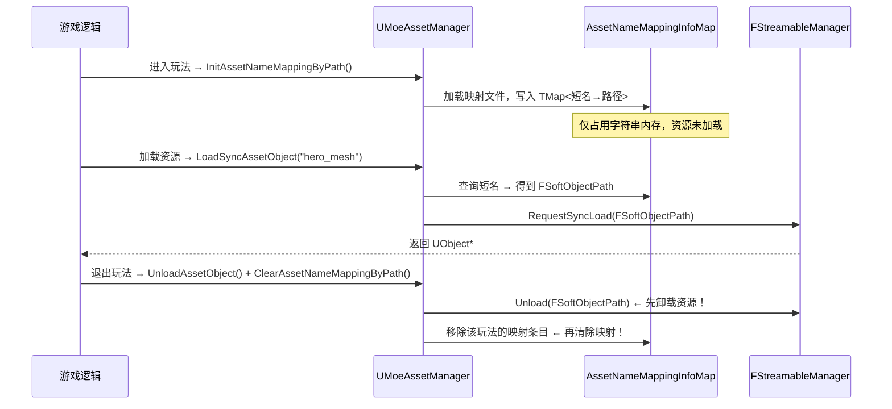

[任务规划完成]
我来结合已有的代码文件，对 LetsGo 项目的资源管理模块进行全面分析总结。
[搜索历史上下文]
[读取历史上下文]
基于三次历史对话的完整内容，现在可以对 LetsGo 项目的资源管理模块进行全面总结。

---

# LetsGo 项目资源管理模块分析总结

## 一、整体架构概览

LetsGo（元梦之星）的资源管理体系由三个层次协同工作，形成完整的资源生命周期管理链路：



---

## 二、UMoeAssetManager vs UAssetManager 核心差异

### 设计哲学的根本不同

| 维度 | `UAssetManager`（UE4 原生） | `UMoeAssetManager`（元梦定制） |
|---|---|---|
| **定位** | 通用引擎框架，兼顾编辑器+运行时 | 专为手游运行时性能优化 |
| **资产寻址** | `FPrimaryAssetId`（类型+名称） | **短名字符串**（如 `"hero_mesh"`） |
| **资产注册** | 依赖 `AssetRegistry` 全量扫描磁盘 | 读取轻量级映射文件（txt/FlatBuffers） |
| **实例模式** | 全局单例 | 非单例，由游戏框架管理 |
| **热更支持** | 不支持运行时动态替换路径 | 映射文件可随热更包下发动态替换 |

### UMoeAssetManager 的五大核心优势

**① 短名映射系统 — 业务与路径解耦**

业务代码只需使用短名，资产移动/重命名只需更新映射文件：
```cpp
// 业务代码永远不需要知道完整路径
LoadSyncAssetObject<USkeletalMesh>("hero_mesh");
```

**② FlatBuffers + MMap 极致性能**

提供三套查询后端，按平台自动选择：

| 模式 | 实现 | 适用场景 |
|---|---|---|
| 普通模式 | `TMap<FString, FString>` | 通用 |
| Ansi 模式 | `TMap<FAnsiStringView, FAnsiStringView>` | 减少 Unicode 内存开销 |
| **FlatBuffers MMap** | 内存映射文件 + 加速索引 | iOS/Mac，零拷贝，OS 管理内存 |

**③ 流式读取映射文件 — 内存友好**

4KB 分块流式读取，避免大文件一次性加载，将峰值内存压到最低（`UAssetManager` 的 `AssetRegistry` 缓存在手游上可达数十 MB）。

**④ 内置性能分析埋点**

所有加载接口都内置了性能采集代理，可实时监控每个资产的加载耗时，`UAssetManager` 完全没有此能力。

**⑤ 线程安全的加载失败上报**

```cpp
static TArray<FString> FailedAssetNames;
static FCriticalSection FailedAssetNamesCriticalSection;
```
配合 Pak 错误事件监听，精准定位线上资产缺失问题。

---

## 三、AssetsNameMapping 按玩法 Mount/UnMount 机制

### 设计模式



### Mount/UnMount 的四大优点

1. **映射表内存按需管理**：每个玩法的 `AssetNameMappingInfo`（预留 80000 条目）在退出时完全释放
2. **命名空间隔离**：不同玩法可以有同名短名，互不干扰
3. **热更动态替换**：退出后卸载，下次进入时加载最新映射文件，无需重启
4. **查询性能稳定**：`AssetNameMappingInfoMap` 始终只含当前活跃玩法的映射，遍历开销不随玩法数量增长

### 关键认知：卸载映射文件 ≠ 卸载资源

这是最容易误解的地方：

```
AssetNameMapping（映射表）  ≠  资源（UObject）
     ↓                              ↓
  字符串字典                  FStreamableManager 持有
  ClearAssetNameMappingByPath    UnloadAssetObject
  释放字典内存                   释放资源引用 → GC 回收
```

**正确的退出顺序**：
```
① 先调用 UnloadAssetObject() 卸载资源（此时映射表还在，能查到路径）
② 再调用 ClearAssetNameMappingByPath() 清除映射表
③ 等待 GC 触发，真正回收 UObject 内存
```

若顺序颠倒（先清映射再卸资源），`GetAssetObjectPath` 找不到路径，资源将无法被主动卸载，只能等 GC 自然回收。

---

## 四、Chunk 与 .pak 文件的关系

### 一对多层级关系

```
Chunk（逻辑单元，ChunkId）
    ├── PakFile_1.pak  ← FPakFile
    ├── PakFile_2.pak  ← FPakFile
    └── PakFile_3.pak  ← FPakFile
```

| 概念 | 类型 | 职责 |
|---|---|---|
| **Chunk** | 逻辑单元（`FChunk`） | 游戏逻辑层面的"功能包"，如某个玩法的所有资源 |
| **.pak 文件** | 物理文件（`FPakFile`） | 磁盘/CDN 上的压缩文件，下载和挂载的最小物理单元 |

### 操作粒度对应关系

| 操作 | 粒度 |
|---|---|
| 下载（Download） | 以 `.pak 文件` 为单位 |
| 挂载（Mount） | 以 `Chunk` 为单位（内部依次挂载所有 .pak） |
| 卸载（Unmount） | 以 `.pak 文件` 为单位 |
| 游戏逻辑感知 | 以 `Chunk` 为单位（`GetChunkStatus`、`OnChunkMounted`） |

### 拆分为多个 .pak 的设计价值

- **断点续传**：单个 .pak 下载失败只需重下该文件，不影响其他
- **并发下载**：同一 Chunk 的多个 .pak 可并行下载（`TargetDownloadsInFlight` 控制并发数）
- **热更粒度精细**：只有部分资源更新时，只替换对应的 .pak，不重下整个 Chunk

---

## 五、整体设计总结

LetsGo 资源管理体系的核心设计思路是：**在 UE4 原生框架之上，针对手游热更场景构建了一套轻量、高性能的资源寻址与生命周期管理系统**，其本质是：

> **绕过 `UAssetManager` 重量级的 PrimaryAsset 体系，直接封装 `FStreamableManager`，自建短名映射系统，配合 Chunk 分包机制，实现资源的按需加载、按玩法隔离、支持热更的完整资源管理方案。**