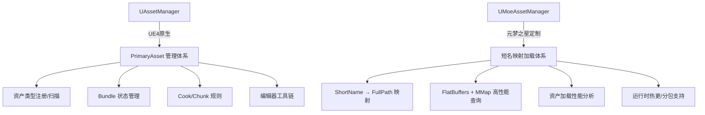

[任务规划完成]
我来对比分析这两个类的区别和设计思路。让我先查看 `UMoeAssetManager` 的实现文件，以便更全面地理解其功能。
[读取文件]
基于对两个类的完整代码分析，我来给出详细的对比分析。

---

## `UMoeAssetManager` vs `UAssetManager` 深度对比分析

### 一、架构定位差异



| 维度 | `UAssetManager` | `UMoeAssetManager` |
|---|---|---|
| **继承关系** | `UObject`（全局单例） | `UObject`（非单例，由游戏框架管理） |
| **核心职责** | PrimaryAsset 生命周期管理 + Cook/Chunk 规则 | **短名到长路径的映射** + 流式加载封装 |
| **资产寻址方式** | `FPrimaryAssetId`（类型+名称） | **短名字符串**（如 `"hero_skin_001"`） |
| **设计目标** | 通用引擎框架，兼顾编辑器/运行时 | 专为手游运行时性能优化 |

---

### 二、`UMoeAssetManager` 的核心优势

#### 1. 短名映射系统（最核心的差异）

`UAssetManager` 要求使用 `FPrimaryAssetId` 或完整的 `FSoftObjectPath` 来引用资产，路径形如：
```
/Game/Characters/Hero/BP_Hero.BP_Hero_C
```

`UMoeAssetManager` 引入了**短名（ShortName）→ 长路径（FullPath）的映射文件**，业务代码只需：
```cpp
LoadSyncAssetObject<USkeletalMesh>("hero_mesh");
```

这带来的好处：
- **业务代码与资产路径解耦**，资产移动/重命名只需更新映射文件，不改业务代码
- **支持热更**：映射文件可以随热更包下发，实现资产路径的动态替换
- **支持多包合并**：`MergeAssetNameMappingByPathAndKey` 允许多个映射文件合并到同一个 Key 下，天然支持分包/DLC 场景

#### 2. FlatBuffers + MMap 极致性能优化

```cpp
// 平台判断，iOS/Mac 默认开启 MMap 模式
static int32 GEnableAssetNameMappingMMap = 0; // Android/PC 默认关闭
// iOS/Mac 默认开启
static int32 GEnableAssetNameMappingMMap = 1;
```

`UMoeAssetManager` 实现了两套查询后端：

| 模式 | 实现 | 特点 |
|---|---|---|
| **普通模式** | `TMap<FString, FString>` | 通用，内存占用较高 |
| **Ansi 模式** | `TMap<FAnsiStringView, FAnsiStringView>` + `FMoeAssetAnsiStringStore` | 减少 Unicode 内存开销 |
| **FlatBuffers MMap 模式** | `FFlatBuffersMappedHandle` + 加速索引 `TMap<FName, uint32>` | **零拷贝内存映射**，查询 O(1)，内存由 OS 管理 |

`UAssetManager` 的资产注册依赖 `AssetRegistry`（全量扫描磁盘），在手游场景下启动慢、内存占用高。

#### 3. 流式读取映射文件（内存友好）

```cpp
// 4KB 分块流式读取，避免大文件一次性加载到内存
constexpr int32 BufferSize = 4 * 1024;
TArray<uint8> Buffer;
Buffer.SetNumUninitialized(BufferSize);
// ...逐块读取并解析
```

`UAssetManager` 的 `AssetRegistry` 缓存文件在手游上可能达到数十 MB，`UMoeAssetManager` 通过流式读取将峰值内存压到最低。

#### 4. 资产加载性能分析埋点

```cpp
// 每次加载都会广播性能数据
if(UMoeAssetLoadAnalysisSubsystem::OnMoeProfilerCollectAssetLoading.IsBound())
    UMoeAssetLoadAnalysisSubsystem::OnMoeProfilerCollectAssetLoading.Broadcast(
        StartTime, StartSeconds, {ObjectPath}, false);
```

所有同步/异步加载接口都内置了**性能采集代理**，可以实时监控每个资产的加载耗时，这是 `UAssetManager` 完全没有的能力。

#### 5. 加载失败上报机制

```cpp
// 监听 Pak 错误事件，收集失败资产名
FCoreDelegates::OnAssetLoadingReport.AddUObject(this, &UMoeAssetManager::OnAssetLoadingReport);

// 线程安全的失败列表
static TArray<FString> FailedAssetNames;
static FCriticalSection FailedAssetNamesCriticalSection;
```

`UMoeAssetManager` 内置了**线程安全的资产加载失败收集**，配合 Pak 错误上报，可以精准定位线上资产缺失问题。

#### 6. UI 资源专项支持

```cpp
FLinearColor GetUserWidgetColor(const FString& ColorName);
FSlateFontInfo GetUserWidgetFont(const FString& FontName);
UDataTable* GetUserWidgetTable(const FString& Name);
```

针对 UI 系统提供了颜色表、字体表的快捷访问接口，并带有 `UserWidgetTables` 缓存，避免重复加载 DataTable。

---

### 三、为什么不直接用 `UAssetManager`？

`UAssetManager` 的设计假设是：
1. **资产在编辑器中被扫描注册**（`ScanPathsForPrimaryAssets`），需要 `AssetRegistry` 全量扫描
2. **资产通过 `PrimaryAssetId` 寻址**，要求资产实现 `GetPrimaryAssetId()` 接口
3. **Bundle/Chunk 管理**面向 PC/主机平台的大型 DLC 分包，不适合手游的热更模型
4. **全局单例**，无法支持多个独立的资产命名空间（如不同业务模块的映射文件隔离）

元梦之星作为手游项目，面临的核心挑战是：
- **热更频繁**：资产路径随版本变化，需要映射文件动态下发
- **内存敏感**：手机内存有限，`AssetRegistry` 全量缓存代价太高
- **启动性能**：`UAssetManager` 的初始扫描在手游上会显著拖慢启动速度
- **短名业务习惯**：策划/程序习惯用短名配置资产，而非完整路径

因此 `UMoeAssetManager` 选择**绕过 `UAssetManager` 的 PrimaryAsset 体系**，直接封装 `FStreamableManager`（`UAssetManager` 内部也是用它加载的），自建了一套更轻量、更适合手游热更场景的短名映射系统。