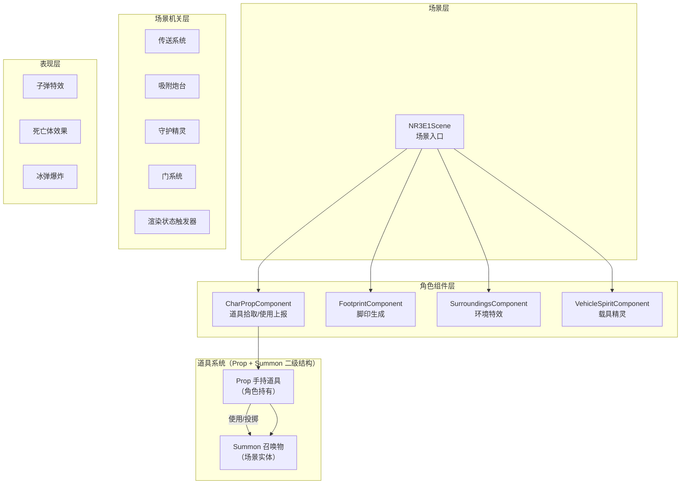
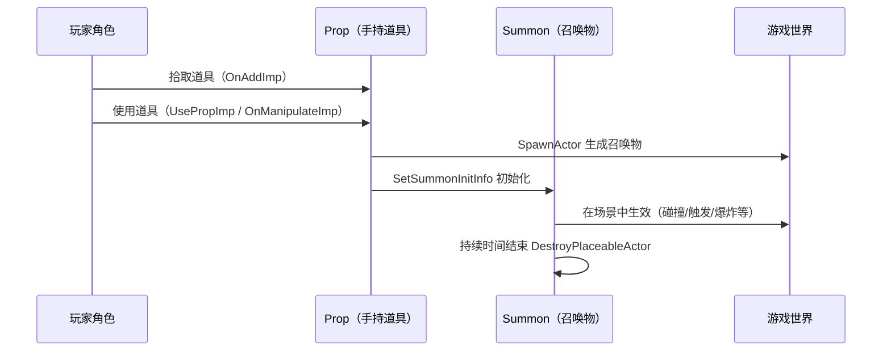
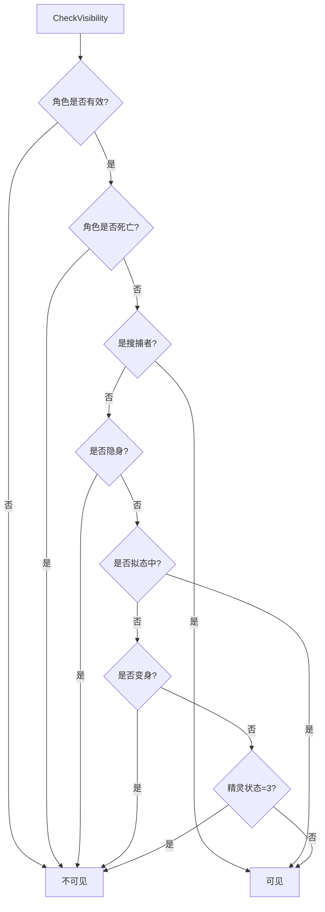
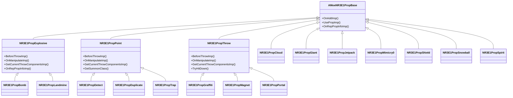
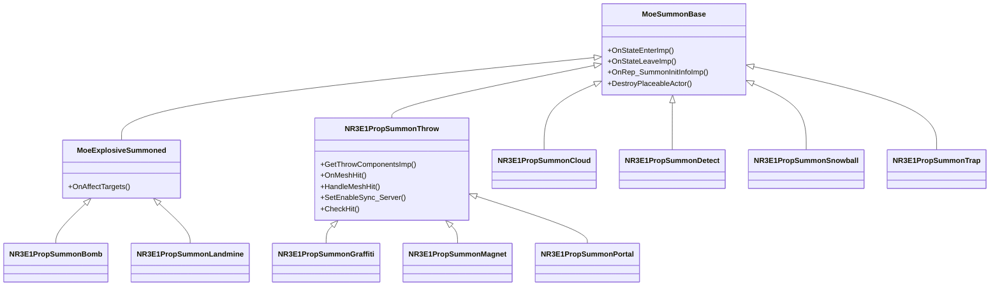
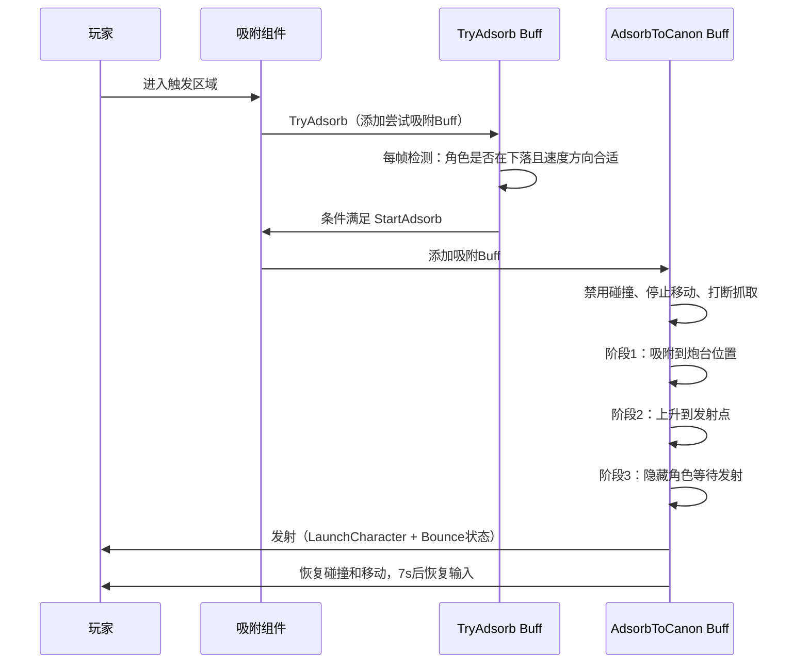
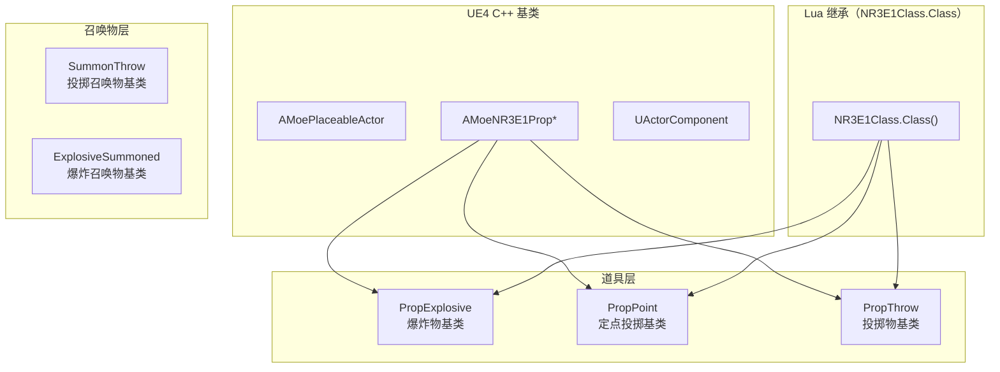
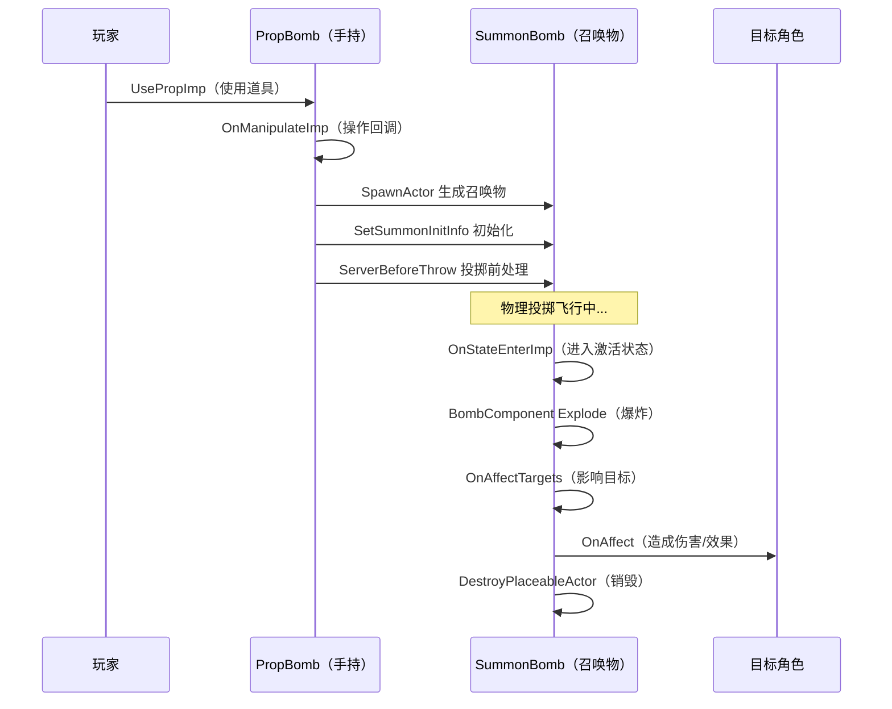
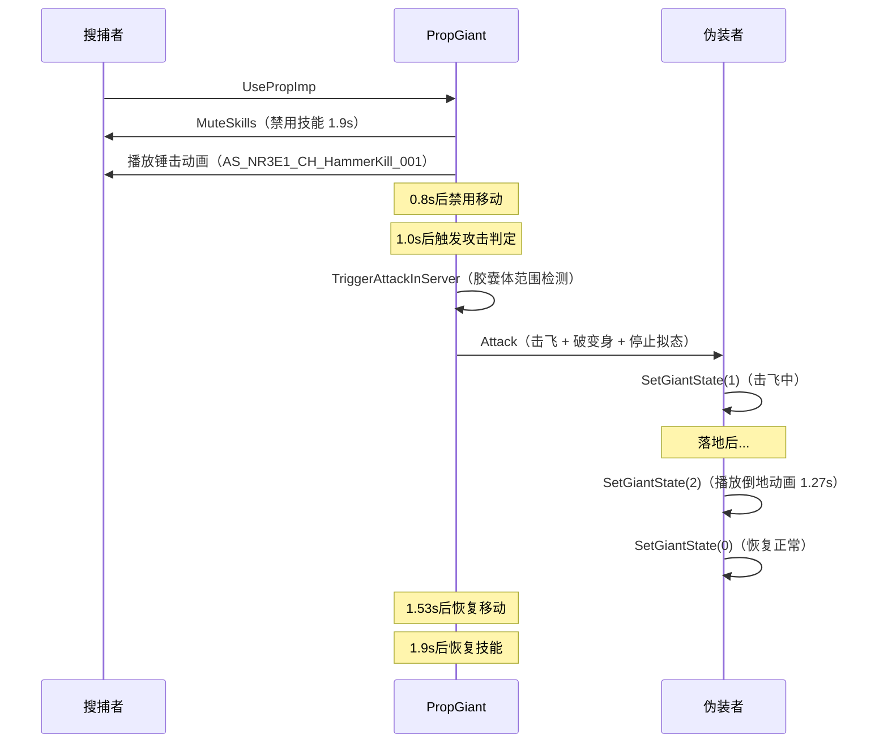

# NR3E1 躲猫猫（Hide and Seek）E1 模块技术文档

> **文档编号**: NR3E1-E1-001 | **创建时间**: 2026-04-14 | **最后更新**: 2026-04-14
> **所属模块**: Feature/NR3E/Script/System/E1 | **玩法ID**: 104
> **文档状态**: ✅ 已完成

---

## 目录

- [1. 系统概述](#1-系统概述)
- [2. 目录结构](#2-目录结构)
- [3. 架构设计](#3-架构设计)
- [4. 核心模块详解](#4-核心模块详解)
- [5. 道具系统（Prop）](#5-道具系统prop)
- [6. 召唤物系统（Summon）](#6-召唤物系统summon)
- [7. 场景机关系统（Misc）](#7-场景机关系统misc)
- [8. 类继承关系图](#8-类继承关系图)
- [9. 关键流程](#9-关键流程)
- [10. 客户端/服务端职责划分](#10-客户端服务端职责划分)
- [11. 配置与依赖](#11-配置与依赖)
- [12. 文件索引](#12-文件索引)

---

## 1. 系统概述

NR3E1（躲猫猫 / Hide and Seek）是 LetsGo 项目中的经典休闲对抗玩法模块，玩法ID为 **104**。游戏分为两个阵营：

| 阵营 | 角色名称 | 核心目标 |
|------|---------|---------|
| **伪装者（Hider）** | 躲藏方 | 变身为场景物体，躲避搜捕者的搜索，存活到时间结束 |
| **搜捕者（Seeker）** | 搜索方 | 在限定时间内找到并淘汰所有伪装者 |

E1 模块位于 `Feature/NR3E/Script/System/E1` 目录下，是躲猫猫玩法的 **Lua 脚本层核心实现**，基于 UnLua 框架与 UE4 C++ 底层交互。模块采用 **组件化 + 放置物（Placeable）** 架构，通过道具（Prop）和召唤物（Summon）的二级结构实现丰富的道具玩法。

---

## 2. 目录结构

```
E1/
├── Bullet/                                # 子弹模块
│   └── NR3E1Bullet.lua                    # 子弹粒子特效管理
├── Component/                             # 角色组件模块
│   ├── NR3E1CharPropComponent.lua         # 角色道具组件（拾取/使用上报）
│   ├── NR3E1FootprintComponent.lua        # 脚印生成组件
│   ├── NR3E1SurroundingsComponent.lua     # 周围环境特效组件
│   ├── NR3E1VehicleSpiritComponent.lua    # 载具精灵组件
│   └── SceneComponent/
│       └── NR3E1IceBombComponent.lua      # 冰弹爆炸组件
├── DeadBody/                              # 死亡体模块
│   └── BP_NR3E1DeathBody_Electric.lua     # 电击死亡体效果
├── Placeable/                             # 放置物模块（核心）
│   ├── BP_NR3E1RenderStateChangeTrigger.lua  # 渲染状态切换触发器
│   ├── DoorExt/                           # 门扩展
│   │   ├── NR3E1PortalDoor.lua            # 传送门
│   │   └── NR3E1SpaceDoor.lua             # 空间门（重力区域）
│   ├── Misc/                              # 场景机关
│   │   ├── BPEC_NR3E1_AdsorbComponent.lua # 吸附组件
│   │   ├── BPGC_NR3E1_AdsorbCanon.lua    # 吸附炮台
│   │   ├── BP_NR3E1_Buff_AdsorbToCanon.lua# 吸附到炮台Buff
│   │   ├── BP_NR3E1_Buff_TryAdsorb.lua   # 尝试吸附Buff
│   │   ├── BP_NR3E1_Spirit.lua            # 守护精灵实体
│   │   ├── NR3E1ChangedActor.lua          # 变身Actor（占位）
│   │   ├── NR3E1Chicken.lua               # 鸡Actor（占位）
│   │   └── NR3E1Teleport.lua              # 传送系统
│   ├── Prop/                              # 道具定义（手持道具）
│   │   ├── NR3E1PropBomb.lua              # 炸弹
│   │   ├── NR3E1PropCloud.lua             # 云朵
│   │   ├── NR3E1PropDetect.lua            # 探测器
│   │   ├── NR3E1PropDuplicate.lua         # 分身
│   │   ├── NR3E1PropExplosive.lua         # 爆炸物基类
│   │   ├── NR3E1PropGiant.lua             # 砰砰锤
│   │   ├── NR3E1PropGraffiti.lua          # 涂鸦
│   │   ├── NR3E1PropJetpack.lua           # 喷气背包
│   │   ├── NR3E1PropLandmine.lua          # 地雷
│   │   ├── NR3E1PropMagnet.lua            # 磁铁
│   │   ├── NR3E1PropMimicry0.lua          # 拟态（隐身）
│   │   ├── NR3E1PropPoint.lua             # 定点投掷基类
│   │   ├── NR3E1PropPortal.lua            # 传送门道具
│   │   ├── NR3E1PropShield.lua            # 护盾
│   │   ├── NR3E1PropSnowball.lua          # 雪人炮弹
│   │   ├── NR3E1PropSpirit.lua            # 守护精灵道具
│   │   ├── NR3E1PropThrow.lua             # 投掷物基类
│   │   └── NR3E1PropTrap.lua              # 陷阱
│   └── Summon/                            # 召唤物（道具释放后的场景实体）
│       ├── NR3E1PropSummonBomb.lua         # 炸弹召唤物
│       ├── NR3E1PropSummonCloud.lua        # 云朵召唤物
│       ├── NR3E1PropSummonDetect.lua       # 探测器召唤物
│       ├── NR3E1PropSummonGraffiti.lua     # 涂鸦召唤物
│       ├── NR3E1PropSummonLandmine.lua     # 地雷召唤物
│       ├── NR3E1PropSummonMagnet.lua       # 磁铁召唤物
│       ├── NR3E1PropSummonPortal.lua       # 传送门召唤物
│       ├── NR3E1PropSummonSnowball.lua     # 雪人炮弹召唤物
│       ├── NR3E1PropSummonThrow.lua        # 投掷物召唤物基类
│       └── NR3E1PropSummonTrap.lua         # 陷阱召唤物
└── Scene/
    └── NR3E1Scene.lua                     # 场景入口
```

---

## 3. 架构设计

### 3.1 整体架构



### 3.2 道具二级结构设计

躲猫猫的道具系统采用 **Prop（手持道具）+ Summon（召唤物）** 的二级结构：



### 3.3 核心设计原则

| 原则 | 说明 |
|------|------|
| **CS 分离** | 通过 `IsServer()` / `IsClient()` / `IsDedicatedServer()` 严格区分客户端和服务端逻辑 |
| **组件化** | 角色功能通过独立组件（CharProp、Footprint、Surroundings 等）实现 |
| **继承复用** | 道具通过 `NR3E1Class.Class()` 实现 Lua 层继承，如 `PropBomb -> PropExplosive` |
| **Overridden 模式** | 通过 `self.Overridden.XXX(self, ...)` 调用父类方法，实现方法重写 |
| **定时器驱动** | 大量使用 `_MOE.TimerManager` 管理延迟逻辑、循环检测和生命周期 |

---

## 4. 核心模块详解

### 4.1 Scene 场景模块

**文件**: `Scene/NR3E1Scene.lua`

场景入口类，继承自 `InGameSceneBase`，负责：
- 场景开始回调 `OnSceneBegin`
- 资源包下载类型配置（`GetPakDownloadType` 返回 15）

### 4.2 Bullet 子弹模块

**文件**: `Bullet/NR3E1Bullet.lua`

继承自 `AMoeNR3E2PropActorBullet`，管理子弹的粒子特效生命周期：

| 方法 | 职责 |
|------|------|
| `UsePropImp` | 使用时挂载粒子特效到 PropMesh |
| `OnPropHitImp` | 命中时销毁粒子 |
| `OnBulletGetFromPool` | 从对象池取出时清理粒子 |
| `OnBulletReturnToPool` | 归还对象池时清理粒子 |

> **注意**: 所有粒子操作仅在客户端执行（`IsDedicatedServer()` 检查）

### 4.3 Component 组件模块

#### 4.3.1 NR3E1CharPropComponent — 角色道具组件

负责道具拾取和使用的数据上报：

| 方法 | 职责 |
|------|------|
| `AddPropBySlotLua` | 道具拾取时上报（`E1PropGetStr`） |
| `CharUseSinglePropLua` | 道具使用时上报（`E1PropUseStr`） |
| `GetNR3E1LevelPropDataMap` | 构建道具蓝图名到ID的映射表（懒加载） |
| `GetNR3E1LevelPropIDByName` | 根据道具名和阵营获取道具ID |
| `GetNR3E1LevelPropDeathTypeByName` | 获取道具对应的死亡类型 |

#### 4.3.2 NR3E1FootprintComponent — 脚印组件

继承自 `BP_FootprintComponent`，控制脚印生成条件：

- **搜捕者**: 始终生成脚印
- **伪装者**: 隐身状态不生成、变身状态不生成、拟态状态生成
- **电梯上**: 不生成脚印

#### 4.3.3 NR3E1SurroundingsComponent — 环境特效组件

继承自 `BP_SurroundingsComponent`，通过 **0.1s 循环定时器** 检测角色可见性变化，控制周围环境特效的开关：



#### 4.3.4 NR3E1VehicleSpiritComponent — 载具精灵组件

继承自 `MoeCharVehicleSpiritComponent`，可见性判断逻辑与 SurroundingsComponent 一致。

#### 4.3.5 NR3E1IceBombComponent — 冰弹组件

继承自 `MoeBombComponent`，在爆炸时播放音效（SfxID: 8005）。

### 4.4 DeadBody 死亡体模块

**文件**: `DeadBody/BP_NR3E1DeathBody_Electric.lua`

电击死亡体效果，通过 `NR3E1Class` 继承体系创建：

| 方法 | 职责 |
|------|------|
| `OnRep_UID` | UID 同步时复制角色外观到死亡体，并附加电击 SkeletalMesh（1秒后移除） |
| `OnEventEndPlayLuaImpl` | 清理定时器和电击网格 |

### 4.5 Placeable 放置物模块

#### BP_NR3E1RenderStateChangeTrigger — 渲染状态触发器

用于水面区域的渲染状态优化，通过 **1s 循环定时器** 检测本地玩家是否在 Box 体积内：

- **进入区域**: 关闭半透明深度写入，根据画质调整 mobileHDR
- **离开区域**: 恢复原始渲染状态

#### DoorExt — 门系统

| 文件 | 功能 |
|------|------|
| `NR3E1PortalDoor` | 传送门，支持开关状态切换（Active/Disable） |
| `NR3E1SpaceDoor` | 空间门，玩家进入触发区域时开门，离开时关门，支持重力区域配置、开关门动画和音效 |

---

## 5. 道具系统（Prop）

### 5.1 道具继承关系



### 5.2 道具分类详解

#### 搜捕者（Seeker）道具

| 道具 | 文件 | 类型 | 功能描述 |
|------|------|------|---------|
| **炸弹** | `NR3E1PropBomb` | 爆炸物 | 继承自 PropExplosive，投掷后爆炸，对范围内伪装者造成伤害 |
| **地雷** | `NR3E1PropLandmine` | 爆炸物 | 继承自 PropExplosive，放置后触发爆炸 |
| **探测器** | `NR3E1PropDetect` | 定点投掷 | 继承自 PropPoint，放置后开启X光视野，持续探测范围内伪装者 |
| **磁铁** | `NR3E1PropMagnet` | 投掷物 | 继承自 PropThrow，命中后产生磁力场，吸引并眩晕范围内角色 |
| **涂鸦** | `NR3E1PropGraffiti` | 投掷物 | 继承自 PropThrow，命中后对范围内搜捕者施加涂鸦效果 |
| **砰砰锤** | `NR3E1PropGiant` | 直接使用 | 播放锤击动画，对前方范围内伪装者造成击飞+破变身效果 |
| **云朵** | `NR3E1PropCloud` | 直接使用 | 在角色脚下放置可踩踏的云朵平台，最多可以使用三次 |
| **喷气背包** | `NR3E1PropJetpack` | 持续效果 | 提供飞行能力，修改重力和摩擦力，附带喷气特效和背包模型 |
| **陷阱** | `NR3E1PropTrap` | 定点投掷 | 继承自 PropPoint，根据阵营选择不同召唤物类 |

#### 伪装者（Hider）道具

| 道具 | 文件 | 类型 | 功能描述 |
|------|------|------|---------|
| **拟态** | `NR3E1PropMimicry0` | 直接使用 | 触发隐身效果（`StartMimiCry`） |
| **护盾** | `NR3E1PropShield` | 直接使用 | 为伪装者添加护盾（`AddShieldLua`） |
| **守护精灵** | `NR3E1PropSpirit` | 直接使用 | 召唤守护精灵，被淘汰时可重生一次（`CallSpirit`） |
| **分身** | `NR3E1PropDuplicate` | 定点投掷 | 在目标位置生成角色分身（`SpawnDuplicateLua`） |
| **雪人炮弹** | `NR3E1PropSnowball` | 直接使用 | 变成雪人炮弹，撞上敌人触发冰冻效果 |
| **传送门** | `NR3E1PropPortal` | 投掷物 | 继承自 PropThrow，放置传送门 |

### 5.3 道具通用机制

**拾取机制**：
```lua
-- 所有道具在 OnAddImp 中统一处理拾取可见性
function Prop:OnAddImp(character, slot)
    self.bOnlyPlayerInArrayCanPick = false
    self:ChangePropVisibilityByTag(true, "CanPickByPlayerUid")
    self.Overridden.OnAddImp(self, character, slot)
end
```

**状态同步**（`OnRepPropInfoImp`）：
- `EMoePropState.OnHand` -> 道具在手上
- `EMoePropState.InOperation` -> 道具使用中（隐藏手持模型，播放投掷动画）
- `EMoePropState.AfterUse` -> 使用完毕

---

## 6. 召唤物系统（Summon）

### 6.1 召唤物继承关系



### 6.2 召唤物详解

| 召唤物 | 基类 | 核心机制 |
|--------|------|---------|
| **SummonBomb** | MoeExplosiveSummoned | 爆炸影响目标，调用 `OnAffect` 处理伤害 |
| **SummonLandmine** | MoeExplosiveSummoned | 落地后开启碰撞检测，伪装者踩中后延迟0.5s爆炸 |
| **SummonCloud** | MoeSummonBase | 可踩踏云朵平台，角色站上时有弹性缩放效果，碰到特定Tag物体或角色时销毁 |
| **SummonDetect** | MoeSummonBase | 开启后持续刷新X光视野（0.2s循环），持续时间结束后关闭 |
| **SummonSnowball** | MoeSummonBase | 附着在角色身上，碰到搜捕者触发冰弹爆炸（IceBombComponent） |
| **SummonTrap** | MoeSummonBase | 伪装为随机道具外观，敌方踩入触发陷阱效果（AddBuffState 103） |
| **SummonThrow** | MoeSummonBase | 投掷物基类，处理物理投掷、碰撞检测、落点同步 |
| **SummonGraffiti** | NR3E1PropSummonThrow | 命中后对范围内搜捕者施加涂鸦Debuff（AddBuffState 102） |
| **SummonMagnet** | NR3E1PropSummonThrow | 命中后产生磁力场，持续吸引并禁止跳跃（CanJump=false） |
| **SummonPortal** | NR3E1PropSummonThrow | 命中后开启传送门，随机传送到出生点 |

---

## 7. 场景机关系统（Misc）

### 7.1 吸附炮台系统



**关键实现细节**：
- 吸附过程分3个阶段（XY平面吸附 -> Z轴上升 -> 等待发射）
- 发射后忽略客户端移动校验7秒，防止高速移动导致的网络纠正
- 机器人玩家发射后静默输入7秒

### 7.2 传送系统（NR3E1Teleport）

通用传送基类，支持：
- 触发器碰撞检测（`OnTriggerBeginOverlap`）
- 2秒循环 Tick 补偿检测（防止碰撞遗漏）
- 可配置的轴向限制（`AllowXAxis` / `AllowYAxis` / `AllowZAxis`）
- 传送后相机重置
- 网络同步（`TeleportDataArray` 属性复制）

### 7.3 守护精灵（BP_NR3E1_Spirit）

精灵实体围绕角色运动，通过曲线（`UCurveVector`）控制轨迹：

| 状态 | 行为 |
|------|------|
| **state=1** | 循环环绕（LoopCurve） |
| **state=2** | 重生动画（RebirthCurve），1.3s后消失 |
| **state=3** | 传送重生，停止更新 |

- 使用 0.01s 循环定时器替代 Tick（因 Tick 存在问题）
- 搜捕者客户端默认隐藏精灵

---

## 8. 类继承关系图



---

## 9. 关键流程

### 9.1 道具使用完整流程（以炸弹为例）



### 9.2 砰砰锤攻击流程



---

## 10. 客户端/服务端职责划分

| 职责 | 服务端（DS） | 客户端（Client） |
|------|-------------|-----------------|
| **道具拾取/使用** | 逻辑判定、数据上报 | - |
| **召唤物生成** | SpawnActor | - |
| **碰撞/伤害判定** | 所有碰撞检测 | - |
| **状态同步** | 属性复制（OnRep_*） | 接收并处理 |
| **粒子特效** | - | 播放/销毁 |
| **音效播放** | - | SoundMgr |
| **动画播放** | - | AnimInstance |
| **Buff属性修改** | ServerToClient 模式 | 接收同步 |
| **传送** | 计算目标位置 | 设置位置 + 相机重置 |
| **脚印/环境特效** | - | 可见性检测 + 特效控制 |

---

## 11. 配置与依赖

### 11.1 核心依赖

| 依赖 | 路径 | 用途 |
|------|------|------|
| `NR3E1GameConfig` | `LetsGo.Script.Config.NR3E1GameConfig` | 游戏配置（阵营、道具槽位、角色组件类等） |
| `NR3E1Class` | `LetsGo.Script.Modplay.Core.GameMode.Games.NR3E.E1.NR3E1Class` | Lua 类继承工具 |
| `NR3E1_HideAndSeekPlayerExtendComponent` | `LetsGo.Script.Modplay.InLevel.NR3E1_HideAndSeekPlayerExtendComponent` | 角色扩展组件（阵营判断、技能控制等） |
| `InGameSceneBase` | `LetsGo.Script.SceneManager.Scene.InGameSceneBase` | 场景基类 |
| `MoeSummonBase` | `LetsGo.Script.Modplay.PlaceableActor.Summon.MoeSummonBase` | 召唤物基类 |
| `MoeExplosiveSummoned` | `LetsGo.Script.Modplay.PlaceableActor.Summon.Explosive.MoeExplosiveSummoned` | 爆炸召唤物基类 |

### 11.2 关键 C++ 类

| C++ 类 | 用途 |
|--------|------|
| `UMoeNR3E1CharBaseComponent` | 角色基础组件（阵营、变身、拟态、精灵等） |
| `AMoeNR3E1GameCharacter` | 游戏角色类 |
| `ANR3E1Game` | 游戏模式类 |
| `UMoeCharBuffComponent` | Buff 组件 |
| `UMoeCharAvatarComponent` | 外观组件 |
| `UMoeBombComponent` | 炸弹组件 |
| `UMoeSimplePhysicsSyncComponent` | 物理同步组件 |

### 11.3 数据表

| 数据表 | 用途 |
|--------|------|
| `NR3E1LevelPropTable` | 关卡道具配置表（蓝图名、阵营、ID映射） |

---

## 12. 文件索引

### 12.1 按模块分类

| 模块 | 文件数 | 总行数(约) | 说明 |
|------|--------|--------|------|
| Scene | 1 | 15 | 场景入口 |
| Bullet | 1 | 79 | 子弹特效 |
| Component | 5 | 328 | 角色组件 |
| DeadBody | 1 | 46 | 死亡体效果 |
| Placeable/DoorExt | 2 | 186 | 门系统 |
| Placeable/Misc | 8 | 756 | 场景机关 |
| Placeable/Prop | 18 | 1316 | 手持道具 |
| Placeable/Summon | 10 | 1330 | 召唤物 |
| **合计** | **46** | **~4056** | - |

### 12.2 核心文件速查

| 文件 | 行数 | 关键词 |
|------|------|--------|
| `NR3E1PropGiant.lua` | 408 | 砰砰锤、击飞、破变身、动画控制 |
| `BP_NR3E1_Buff_AdsorbToCanon.lua` | 291 | 吸附炮台、发射、移动校验 |
| `NR3E1Teleport.lua` | 286 | 传送、位置同步、相机重置 |
| `NR3E1PropSummonSnowball.lua` | 211 | 雪人炮弹、冰弹爆炸、物理同步 |
| `BP_NR3E1_Spirit.lua` | 209 | 守护精灵、曲线运动、重生 |
| `NR3E1PropJetpack.lua` | 192 | 喷气背包、飞行、Buff效果 |
| `NR3E1PropSummonThrow.lua` | 183 | 投掷物基类、碰撞检测、落点同步 |
| `NR3E1PropSummonLandmine.lua` | 175 | 地雷、延迟爆炸、触发检测 |
| `NR3E1PropSummonTrap.lua` | 173 | 陷阱、伪装外观、踩入触发 |
| `NR3E1PropThrow.lua` | 165 | 投掷物基类、动画、射线检测 |

---

> **文档维护说明**: 本文档基于 `Feature/NR3E/Script/System/E1` 目录下的 46 个 Lua 源文件自动梳理生成。如有模块新增或重构，请同步更新本文档。
